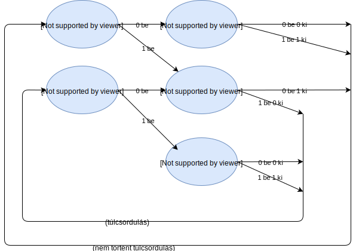

## 7. hét

### Bitek kiírása

A program kérjen be egy 0-255-ig tartó egész számot (unsigned char típus), majd írja ki azt kettes számrendszerben (vezető nullákkal és anélkül is)!
<details>
 <summary>megoldás:</summary>
 
```C
// byte bekérése
unsigned char byte;
printf("irj be egy szamot (0-255): "); scanf("%uc", &byte);

// 8 bit kiírása egyenként, vezető nullákkal
for(int i=7; i>=0; i--){
    if((byte>>i)&1 == 1)
        printf("1");
    else
        printf("0");
}
printf("\n");

// 8 bit kiírása egyenként, vezető nullák nélkül
for(int i=7; i>=0; i--){
    if((byte>>i)!=0){
        if((byte>>i)&1 == 1)
            printf("1");
        else
            printf("0");
    }
}
printf("\n");
```
</details>

### Bitek 1-re írása maszk alapján

Adott egy byte (unsigned char), aminek néhány bitjét 1-re akarjuk állítani, a többit pedig sértetlenül hagyjuk. Az, hogy melyik byteokat állítjuk 1-re, egy úgynevezett bitmaszk tartalmazza, aminek a megfelelő helyein van 1-es érték. 
<details>
 <summary>péda:</summary>
 
```
eredeti byte: 10110101
maszk:        10000110
eredmény:     10110111
```
</details>
<details>
 <summary>megoldás:</summary>
 
```C
unsigned char byte = 0b10110101, maszk=0b10000110;
byte |= maszk;
```
</details>

### Bitek 0-ra írása maszk alapján

A feladat az előzőhöz hasonló, de itt a maszk azt mondja meg, hogy melyik bájtok legyenek 0-ra állítva.
<details>
 <summary>péda:</summary>
 
```
eredeti byte: 10110101
maszk:        10000110
eredmény:     00110001
```
</details>
<details>
 <summary>megoldás:</summary>
 
```C
unsigned char byte = 0b10110101, maszk=0b10000110;
byte &= ~maszk;
```
</details>

### Bitek cserélése maszk alapján

A feladat az előzőhöz hasonló, de itt a maszk azt mondja meg, hogy melyik bájtok legyenek invertálva.
<details>
 <summary>péda:</summary>
 
```
eredeti byte: 10110101
maszk:        10000110
eredmény:     00110011
```
</details>
<details>
 <summary>megoldás:</summary>
 
```C
unsigned char byte = 0b10110101, maszk=0b10000110;
byte ^= maszk;
```
</details>

### n-edik bit 1-re írása

A feladat hasonló az előzőekhez, de most nem maszk adja meg az 1-re állítandó biteket, hanem egy szám mondja meg, hogy hanyadik bitet kell 1-re állítani. A bitek számozása 0-ról indul a legkisebb helyiértéktől.
<details>
 <summary>péda:</summary>
 
```
eredeti byte: 10110101
n: 3
eredmény:     10111101
```
</details>
<details>
 <summary>megoldás:</summary>
 
```C
unsigned char byte = 0b10110101;
int n = 3;
byte |= (1<<n);
```
</details>

### n-edik bit 0-re írása

A feladat az előzőhöz hasonló, de itt n a nullára állítandó bit sorszáma.
<details>
 <summary>péda:</summary>
 
```
eredeti byte: 10110101
n: 4
eredmény:     10100101
```
</details>
<details>
 <summary>megoldás:</summary>
 
```C
unsigned char byte = 0b10110101;
int n = 4;
byte &= ~(1<<n);
```
</details>

### n-edik bit invertálása

A feladat az előzőhöz hasonló, de itt n az invertálandó bit sorszáma.
<details>
 <summary>péda:</summary>
 
```
eredeti byte: 10110101
n: 5
eredmény:     10010101
```
</details>
<details>
 <summary>megoldás:</summary>
 
```C
unsigned char byte = 0b10110101;
int n = 5;
byte ^= (1<<n);
```
</details>

### Ly pontosító

A program kérjen be egy szöveget, amiben minden elipszilonos ly-t pontos j-re cserél. Csak a kisbetűkre kell működnie, de a hosszúra is!
<details>
 <summary>megoldás:</summary>
 
```C
#define _CRT_SECURE_NO_WARNINGS
#include <stdio.h>

// az állapotterünk elnevezése
#define ALAP 0 // kiindulási állapot
#define EGYL 1 // előző karakter l volt
#define KETL 2 // előző két karakter l volt

int main(){
    // kiindulási állapot: ALAP
    int allapot = ALAP;
    
    printf("irj be egy szoveget: ");
    while(1){
        // bemenet beolvasása
        char ch;
        scanf("%c", &ch);
        
        // aktuális állapot szerinti viselkedés
        switch (allapot){
            // alapállapot
            case ALAP:
                if(ch=='l')
                    allapot=EGYL;
                else
                    printf("%c", ch);
                break;
            
            // már volt egy l
            case EGYL:
                if(ch=='l'){
                    allapot=KETL;
                } else if(ch=='y') {
                    printf("j");
                    allapot=ALAP;
                } else {
                    printf("l%c",ch);
                    allapot=ALAP;
                }
                break;
            
            // már volt két l
            case KETL:
                if(ch=='y')
                    printf("jj");
                else
                    printf("ll%c", ch);
                allapot=ALAP;
                break;
        }
    }
    
    return 0;
}
```
</details>

### Bináris összeadó állapotgép

Készítsünk állapotgépet, ami összead két bináris számot!

Az állapotgép felváltva kapja a számjegyeket az egyik és a másik számból és egyesével adja ki az összeg számjegyeit.

Célszerű a működési példa és az állapotábra alapján dolgozni.

<details>
<summary>összeadás példa:</summary>
    
```
Az összeadás a következő:
 010011
+100111
 ______
 111010
 
 A rendszer bemenete ekkor:
 111101001001
 
 A rendszer kimenete:
 010111
```
</details>


<details>
<summary>működési példa:</summary>
    
```
bemenet: 1
bemenet: 1
ki: 0
bemenet: 1
bemenet: 1
ki: 1
bemenet: 0
bemenet: 1
ki: 0
bemenet: 0
bemenet: 0
ki: 1
bemenet: 1
bemenet: 0
ki: 1
bemenet: 0
bemenet: 1
ki: 1
```
</details>

<details>
<summary>állapotábra:</summary>


</details>

<details>

 <summary>megoldás:</summary>
 
```C
#define _CRT_SECURE_NO_WARNINGS
#include <stdio.h>

// az állapotterünk elnevezése
#define ELSO_SZAM_NINCS_ATVITEL 0
#define ELSO_SZAM_VAN_ATVITEL 1
#define MASODIK_SZAM_NINCS_ATVITEL 2
#define MASODIK_SZAM_1_ATVITEL 3
#define MASODIK_SZAM_2_ATVITEL 4

int main(){
    // kiindulási állapot: első szám beolvasása, nincs átvitel
    int allapot = ELSO_SZAM_NINCS_ATVITEL;
    
    while(1){
        // bemenet beolvasása
        int bit;
        printf("bemenet: ");
        scanf("%d", &bit);
        
        // aktuális állapot szerinti viselkedés
        switch (allapot){
            case ELSO_SZAM_NINCS_ATVITEL:
                if(bit==1)
                    allapot=MASODIK_SZAM_1_ATVITEL;
                else
                    allapot=MASODIK_SZAM_NINCS_ATVITEL;
                break;
                
            case ELSO_SZAM_VAN_ATVITEL:
                if(bit==1)
                    allapot=MASODIK_SZAM_2_ATVITEL;
                else
                    allapot=MASODIK_SZAM_1_ATVITEL;
                break;
                
            case MASODIK_SZAM_NINCS_ATVITEL:
                if(bit==1){
                    printf("ki: 1\n");
                    allapot = ELSO_SZAM_NINCS_ATVITEL;
                } else {
                    printf("ki: 0\n");
                    allapot = ELSO_SZAM_NINCS_ATVITEL;
                }
                break;
                
            case MASODIK_SZAM_1_ATVITEL:
                if(bit==1){
                    printf("ki: 0\n");
                    allapot = ELSO_SZAM_VAN_ATVITEL;
                } else {
                    printf("ki: 1\n");
                    allapot = ELSO_SZAM_NINCS_ATVITEL;
                }
                break;
                
            case MASODIK_SZAM_2_ATVITEL:
                if(bit==1){
                    printf("ki: 1\n");
                    allapot = ELSO_SZAM_VAN_ATVITEL;
                } else {
                    printf("ki: 0\n");
                    allapot = ELSO_SZAM_VAN_ATVITEL;
                }
                break;
        }
    }
    
    return 0;
}
```
</details>


