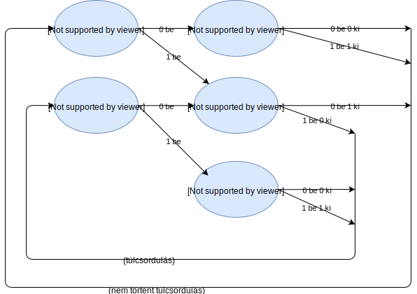

# Számítógépek programozásának alapjai feladatok

A tantárgy sikeres teljesítéséhez elengedhetetlen a rendszeres gyakorlás. Ez a feladatgyűjtemény a készülést segíti, de mindenkinek magának kell érezni, hogy mennyi gyakorlásra van szüksége.

A feladatok megoldása nem a teljes (lefordítható) forráskódot tartalmazza, csupán a lényeges részt.

Eredményes gyakorlást kívánok!

## 1. hét

### Üdvözlet

Írj egy programot, ami kiírja, hogy "Hello BME!"!
<details>
 <summary>megoldás:</summary>
 
```C
printf("Hello BME!\n");
```
</details>

### Doboz

Írj egy programot, ami kirajzol egy #-ekből álló 4 karakter széles, 3 karakter magas dobozt. Csak egyetlen printf-et használhatsz!
<details>
 <summary>megoldás:</summary>
 
```C
printf("####\n####\n####\n");
```
</details>

### Maradékos osztás

A program kérjen be egy osztandót és egy osztót, majd írja ki a hányadost és a maradékot!
<details>
 <summary>megoldás:</summary>
 
```C
int osztando, oszto;
printf("osztando: ");
scanf("%d", &osztando);
printf("oszto: ");
scanf("%d", &oszto);
printf("hanyados: %d\nmaradek: %d\n", osztando/oszto, osztando%oszto);
```
</details>

### Téglatest

A program kérje be egy téglatest oldalhosszait, majd írja ki felszínét, térfogatát és éleinek összhosszúságát!
<details>
 <summary>megoldás:</summary>
 
```C
double a,b,c;
printf("egyik oldal hossza: "); scanf("%lf", &a);
printf("masik oldal hossza: "); scanf("%lf", &b);
printf("harmadik oldal hossza: "); scanf("%lf", &c);
printf("felszin = %g\n", 2*a*b+2*a*c+2*b*c);
printf("terfogat = %g\n", a*b*c);
printf("elhossz = %g\n", 4*a+4*b+4*c);
```
</details>

### Mozgás

A program kérje be egy egyenes vonalon mozgó pont kezdőpozícióját, kezdősebességét, gyorsulását és mozgásának idejét. Eredményként írja ki a mozgás végén a pozícióját és sebességét. A mozgás során a pont gyorsulása állandó. Az eredményeket 4 tizedes pontossággal írja ki.
<details>
 <summary>megoldás:</summary>
 
```C
// kezdeti paraméterek beolvasása
double x0,v0,a,t;
printf("kezdopozicio: "); scanf("%lf", &x0);
printf("kezdosebesseg: "); scanf("%lf", &v0);
printf("gyorsulas: "); scanf("%lf", &a);
printf("ido: "); scanf("%lf", &t);

// mozgás számítása (négyzetes úttörvény)
double xt = x0 + a/2*t*t + v0 * t;
double vt = v0 + a*t;

// eredmények kiírása
printf("pozicio a mozgas vegen: %.4f\n", xt);
printf("vegsebesseg: %.4f\n", vt);
```
</details>

### Kedvező ár

Egy bolt termékeinek árait úgy akarják emelni, hogy a vásárlóknak ne legyen szembetűnő. Éppen ezért minden termék árát úgy emelik, hogy 99-re végződjön. Az eleve 99-re végződő árak változatlanul maradnak. Írj programot, ami bekéri egy termék árát, és kiírja az áremelés utáni árat!
<details>
 <summary>megoldás:</summary>
 
```C
// régi ár bekérése
int regi;
printf("ar: "); scanf("%d", &regi);

// új ár kiszámítása
int uj = regi + 99 - regi%100;

// új ár kiírása
printf("uj ar: %d\n", uj);
```
</details>

### Törtszámok

A program kérje be két törtszám számlálóját és nevezőjét, majd írja ki az összegüket törtvonalas tört alakban. Egyszerűsítést nem kell végezni.
<details>
 <summary>megoldás:</summary>
 
```C
int a_nev, a_szam, b_nev, b_szam;
printf("egyik szam szamlaloja: "); scanf("%d", &a_szam);
printf("egyik szam nevezoje: "); scanf("%d", &a_nev);
printf("masik szam szamlaloja: "); scanf("%d", &b_szam);
printf("masik szam nevezoje: "); scanf("%d", &b_nev);

printf("az osszeg: %d/%d\n", a_nev*b_szam+a_szam*b_nev, a_nev*b_nev);
```
</details>

## 2. hét

### Időintervallum

A program kérjen be óra:perc:másodperc formátumban egy időintervallum elejét és végét. Írja ki az intervallum hosszát másodpercben és óra:perc:másodperc formátumban is.

<details>
 <summary>működési példa:</summary>
 
```
kezdo idopont: 8:15:9
vegso idopont: 12:21:38
Az intervallum 14789 masodpercig tart.
Az intervallum hossza: 4:6:29
```
</details>
<details>
 <summary>megoldás:</summary>
 
```C
// bekérjük az intervallum végeit
int kezd_ora, kezd_perc, kezd_masodperc;
printf("kezdo idopont: ");
scanf("%d:%d:%d", &kezd_ora, &kezd_perc, &kezd_masodperc);
int veg_ora, veg_perc, veg_masodperc;
printf("vegso idopont: ");
scanf("%d:%d:%d", &veg_ora, &veg_perc, &veg_masodperc);

// intervallum hossza másodpercekben
int masodpercek = veg_ora*3600 + veg_perc*60 + veg_masodperc - kezd_ora*3600 - kezd_perc*60 - kezd_masodperc;
printf("Az intervallum %d masodpercig tart.\n", masodpercek);

// kiírás szép formátumban
printf("Az intervallum hossza: %d:%d:%d\n", masodpercek/3600, masodpercek/60%60, masodpercek%60);

```
</details>

### Nagybetűsítő

A program kérjen be egy kisbetűt és írja ki a beírt betűt nagybetűsítve. (Megjegyzés: scanf-fel való karakter beolvasásánál is kell entert ütni a bevitelhez.)
<details>
 <summary>megoldás:</summary>
 
```C
char ch;
printf("irj be egy kisbetut: "); scanf("%c", &ch);
printf("nagybetu: %c", ch-32);
```
</details>

### Négyzetszámok

A program írja ki (sorszámokkal együtt) az első 20 négyzetszámot!
<details>
 <summary>megoldás:</summary>
 
```C
for(int i=0; i<=20; i++){
    printf("%d.\t%d\n", i, i*i);
}
```
</details>

### Szorzótábla

A program írja ki a példa szerinti formában a szorzótáblát
<details>
 <summary>működési példa:</summary>
 
```
    1    2    3    4    5    6    7    8    9   10
    2    4    6    8   10   12   14   16   18   20
    3    6    9   12   15   18   21   24   27   30
    4    8   12   16   20   24   28   32   36   40
    5   10   15   20   25   30   35   40   45   50
    6   12   18   24   30   36   42   48   54   60
    7   14   21   28   35   42   49   56   63   70
    8   16   24   32   40   48   56   64   72   80
    9   18   27   36   45   54   63   72   81   90
   10   20   30   40   50   60   70   80   90  100
```
</details>
<details>
 <summary>megoldás:</summary>
 
```C
for(int i=1; i<=10; i++){
    for(int j=1; j<=10; j++){
        printf("%5d", i*j);
    }
    printf("\n");
}
```
</details>

### Doboz II.

A program kérje be egy doboz szélességét és magasságát, majd rajzolja ki karakterekből a minta szerint.
<details>
 <summary>minta:</summary>
 
```
#-------#
|       |
|       |
|       |
#-------#
```
</details>
<details>
 <summary>megoldás:</summary>
 
```C
// bekérjük a doboz méreteit
int sz, m;
printf("szelesseg: "); scanf("%d", &sz);
printf("magassag: "); scanf("%d", &m);

// doboz teteje
printf("#");
for(int i=1; i<=sz-2; i++)
    printf("-");
printf("#\n");

// doboz oldalai
for(int i=1; i<=m-2; i++){
    printf("|");
    for(int j=1; j<=sz-2; j++)
        printf(" ");
    printf("|\n");
}

// doboz alja
printf("#");
for(int i=1; i<=sz-2; i++)
    printf("-");
```
</details>
<details>
 <summary>elegánsabb megoldás:</summary>
 
```C
// bekérjük a doboz méreteit
int sz, m;
printf("szelesseg: "); scanf("%d", &sz);
printf("magassag: "); scanf("%d", &m);

// koordináták alapján döntjük el a kiírandó karaktert
for(int y=1; y<=m; y++){
    for(int x=1; x<=sz; x++){
        if( (x==1 || x==sz) && (y==1 || y==m) ){
            printf("#");
        } else if(x==1 || x==sz){
            printf("|");
        } else if(y==1 || y==m){
            printf("-");
        } else {
            printf(" ");
        }
    }
    printf("\n");
}
```
</details>

### Doboz III.

A program kérje be egy négyzetes doboz oldalhosszát, majd rajzolja ki karakterekből a minta szerint.
<details>
 <summary>minta:</summary>
 
```
#---#
|\  |
| \ |
|  \|
#---#
```
</details>
<details>
 <summary>megoldás:</summary>
 
```C
// bekérjük a doboz oldalhosszát
int oldal;
printf("oldalhossz: "); scanf("%d", &oldal);

// koordináták alapján döntjük el a kiírandó karaktert
for(int y=1; y<=oldal; y++){
    for(int x=1; x<=oldal; x++){
        if( (x==1 || x==oldal) && (y==1 || y==oldal) ){
            printf("#");
        } else if(x==1 || x==oldal){
            printf("|");
        } else if(y==1 || y==oldal){
            printf("-");
        } else if(x==y){
            printf("\\");
        } else {
            printf(" ");
        }
    }
    printf("\n");
}
```
</details>

### Doboz IV.

A program kérje be egy négyzetes doboz oldalhosszát, majd rajzolja ki karakterekből a minta szerint. A minimális oldalhossz 5 (akkor is ekkorát rajzoljon ki, ha a felhasználó kisebb számot adott meg). Az oldalhossz csak páratlan lehet, ha a megadott szám páros, akkor a nála eggyel nagyobb páratlan szám legyen az oldalhossz.
<details>
 <summary>minta:</summary>
 
```
#-----#
|\   /|
| \ / |
|  X  |
| / \ |
|/   \|
#-----#
```
</details>
<details>
 <summary>megoldás:</summary>
 
```C
// bekérjük a doboz oldalhosszát
int oldal;
printf("oldalhossz: "); scanf("%d", &oldal);

// oldalhossz javítása, ha szükséges
if(oldal<5)
    oldal = 5;
if(oldal%2==0)
    oldal++;

// koordináták alapján döntjük el a kiírandó karaktert
for(int y=1; y<=oldal; y++){
    for(int x=1; x<=oldal; x++){
        if( (x==1 || x==oldal) && (y==1 || y==oldal) ){
            printf("#");
        } else if(x==(oldal+1)/2 && x==y){
            printf("X");
        } else if(x==1 || x==oldal){
            printf("|");
        } else if(y==1 || y==oldal){
            printf("-");
        } else if(x==y){
            printf("\\");
        } else if(x+y==oldal+1){
            printf("/");
        } else {
            printf(" ");
        }
    }
    printf("\n");
}
```
</details>

### Faktoriális

Írja ki a program a beolvasott szám faktoriálisát. (A faktoriális nagyon nagy szám is lehet, ennek megfelelő típust kell választani.)
<details>
 <summary>megoldás:</summary>
 
```C
// bekérjük a számot és a kitevőt
int n;
printf("irj be egy szamot: "); scanf("%d", &n);

// faktoriális kiszámítása
unsigned long int fakt=1;

for(int i=1; i<=n; i++)
    fakt *= i;


// eredmény kiírása
printf("%d! = %lu", n, fakt);
```
</details>

### Fibonacci

Írja ki a program a Fibonacci-sorozat első 20 elemét! Az első két elem értéke 1, a többi elem pedig az előző kettő összegével egyenlő. 
<details>
 <summary>megoldás:</summary>
 
```C
int mostani=1, kovetkezo=1, kovetkezo_utani;
for(int i=1; i<=20; i++){
    // jelenlegi tag kiírása
    printf("%d\n", mostani);
    
    // következő utáni tag kiszámítása
    kovetkezo_utani = mostani+kovetkezo;
    
    // léptetés
    mostani = kovetkezo;
    kovetkezo = kovetkezo_utani;
}
```
</details>

### Hatvány

A program kérjen be egy valós alapot és egy egész kitevőt, majd írja ki a hatvány értékét.
<details>
 <summary>megoldás:</summary>
 
```C
// bekérjük az alapot és a kitevőt
double alap;
printf("alap: "); scanf("%lf", &alap);
int kitevo;
printf("kitevo: "); scanf("%d", &kitevo);

// hatvány számolása
double hatvany = 1;
for(int i=1; i<=kitevo; i++){
    hatvany*=alap;
}

// eredmény kiírása
printf("hatvany: %g\n", hatvany);
```
</details>

### Négyzetgyök

A program kérjen be egy valós számot, és írja ki négyzetgyökét tízezred pontossággal. A számoláshoz [intervallumfelezést](http://www.mathpath.org/Algor/squareroot/algor.square.root.binary.htm) célszerű használni.
<details>
 <summary>megoldás:</summary>
 
```C
// bekérjük a számot
double szam;
printf("irj be egy szamot: "); scanf("%lf", &szam);

// a kezdeti intervallum: 0-tól szam-ig
double also=0, felso=szam;

// intervallumfelezés, amíg tízezred pontosságú nem lesz az eredmény
while(felso-also > 0.0001){
    // intervallum közepe
    double kozep = (also+felso)/2;
    
    // felezés - melyik felében van a megoldás?
    if(kozep*kozep < szam){
        also = kozep;
    } else {
        felso = kozep;
    }
}

// eredmény kiírása
printf("negyzetgyok: %f\n", (also+felso)/2);
```
</details>

### n-edik gyök

Módosítsd az előző programot úgy, hogy egész gyökkitevőt is kérjen be.
<details>
 <summary>megoldás:</summary>
 
```C
// bekérjük a számot és a kitevőt
double szam;
printf("irj be egy szamot: "); scanf("%lf", &szam);
int n;
printf("ird be a gyokkitevot: "); scanf("%d", &n);

// a kezdeti intervallum: 0-tól szam-ig
double also=0, felso=szam;

// intervallumfelezés, amíg tízezred pontosságú nem lesz az eredmény
while(felso-also > 0.0001){
    // intervallum közepe
    double kozep = (also+felso)/2;
    
    // hatvány kiszámítása
    double hatvany=1;
    for(int i=1; i<=n; i++){
        hatvany *= kozep;
    }
    
    // felezés - melyik felében van a megoldás?
    if(hatvany < szam){
        also = kozep;
    } else {
        felso = kozep;
    }
}

// eredmény kiírása
printf("gyok: %f\n", (also+felso)/2);
```
</details>

### Sakktábla I.

A program # és szóköz karakterekből rajzoljon ki egy sakktáblát (8x8 mezőt).
<details>
<summary>működési példa:</summary>
 
```
# # # # 
 # # # #
# # # # 
 # # # #
# # # # 
 # # # #
# # # # 
 # # # #
```
</details>
<details>
 <summary>megoldás:</summary>
 
```C
// soronként és azon belül oszloponként minden karaktert kirajzolunk
for(int sakk_y=1; sakk_y<=8; sakk_y++){
    for(int sakk_x=1; sakk_x<=8; sakk_x++){
        // mező színének meghatározása
        if((sakk_x+sakk_y)%2==0)
            printf("#");
        else
            printf(" ");
    }
    printf("\n");
}
```
</details>

### Sakktábla II.

A program úgy rajzolja ki a sakktáblát, hogy egy a mezők számát (széltében és magasságban) meg lehet adni.
<details>
<summary>működési példa:</summary>
 
```
sakktabla szelessege (db mezo): 7
sakktabla magassage (db mezo): 6
# # # #
 # # # 
# # # #
 # # # 
# # # #
 # # # 

```
</details>
<details>
 <summary>megoldás:</summary>
 
```C
// bekérjük a sakktábla méreteit
int sakk_sz, sakk_m;
printf("sakktabla szelessege (db mezo): "); scanf("%d", &sakk_sz);
printf("sakktabla magassage (db mezo): "); scanf("%d", &sakk_m);

// soronként és azon belül oszloponként minden karaktert kirajzolunk
for(int sakk_y=1; sakk_y<=sakk_m; sakk_y++){
    for(int sakk_x=1; sakk_x<=sakk_sz; sakk_x++){
        // mező színének meghatározása
        if((sakk_x+sakk_y)%2==0)
            printf("#");
        else
            printf(" ");
    }
    printf("\n");
}
```
</details>

### Sakktábla III.

A program úgy rajzolja ki a sakktáblát, hogy egy mező szélességét és magasságát is meg lehet adni.
<details>
<summary>működési példa:</summary>
 
```
mezo szelessege (db karakter): 4
mezo magassage (db karakter): 3
####    ####    ####    ####    
####    ####    ####    ####    
####    ####    ####    ####    
    ####    ####    ####    ####
    ####    ####    ####    ####
    ####    ####    ####    ####
####    ####    ####    ####    
####    ####    ####    ####    
####    ####    ####    ####    
    ####    ####    ####    ####
    ####    ####    ####    ####
    ####    ####    ####    ####
####    ####    ####    ####    
####    ####    ####    ####    
####    ####    ####    ####    
    ####    ####    ####    ####
    ####    ####    ####    ####
    ####    ####    ####    ####
####    ####    ####    ####    
####    ####    ####    ####    
####    ####    ####    ####    
    ####    ####    ####    ####
    ####    ####    ####    ####
    ####    ####    ####    ####
```
</details>
<details>
 <summary>megoldás:</summary>
 
```C
// bekérjük a sakktábla méreteit
int mezo_sz, mezo_m;
printf("mezo szelessege (db karakter): "); scanf("%d", &mezo_sz);
printf("mezo magassage (db karakter): "); scanf("%d", &mezo_m);

// két koordinátarendszer: mezők koordinátái és mezőn belüli koordináták
for(int sakk_y=1; sakk_y<=8; sakk_y++){
    for(int mezo_y=1; mezo_y<=mezo_m; mezo_y++){
        for(int sakk_x=1; sakk_x<=8; sakk_x++){
            for(int mezo_x=1; mezo_x<=mezo_sz; mezo_x++){
                // mező színének meghatározása
                if((sakk_x+sakk_y)%2==0)
                    printf("#");
                else
                    printf(" ");
            }
        }
        printf("\n");
    }
}
```
</details>

### Sakktábla IV.

A program úgy rajzolja ki a sakktáblát, hogy a mezők számát és méretét is meg lehessen adni.
<details>
<summary>működési példa:</summary>
 
```
sakktabla szelessege (db mezo): 7
sakktabla magassage (db mezo): 6
mezo szelessege (db karakter): 5
mezo magassage (db karakter): 4
#####     #####     #####     #####
#####     #####     #####     #####
#####     #####     #####     #####
#####     #####     #####     #####
     #####     #####     #####     
     #####     #####     #####     
     #####     #####     #####     
     #####     #####     #####     
#####     #####     #####     #####
#####     #####     #####     #####
#####     #####     #####     #####
#####     #####     #####     #####
     #####     #####     #####     
     #####     #####     #####     
     #####     #####     #####     
     #####     #####     #####     
#####     #####     #####     #####
#####     #####     #####     #####
#####     #####     #####     #####
#####     #####     #####     #####
     #####     #####     #####     
     #####     #####     #####     
     #####     #####     #####     
     #####     #####     #####   
```
</details>
<details>
 <summary>megoldás:</summary>
 
```C
// bekérjük a sakktábla méreteit
int sakk_sz, sakk_m, mezo_sz, mezo_m;
printf("sakktabla szelessege (db mezo): "); scanf("%d", &sakk_sz);
printf("sakktabla magassage (db mezo): "); scanf("%d", &sakk_m);
printf("mezo szelessege (db karakter): "); scanf("%d", &mezo_sz);
printf("mezo magassage (db karakter): "); scanf("%d", &mezo_m);

// két koordinátarendszer: mezők koordinátái és mezőn belüli koordináták
for(int sakk_y=1; sakk_y<=sakk_m; sakk_y++){
    for(int mezo_y=1; mezo_y<=mezo_m; mezo_y++){
        for(int sakk_x=1; sakk_x<=sakk_sz; sakk_x++){
            for(int mezo_x=1; mezo_x<=mezo_sz; mezo_x++){
                // mező színének meghatározása
                if((sakk_x+sakk_y)%2==0)
                    printf("#");
                else
                    printf(" ");
            }
        }
        printf("\n");
    }
}
```
</details>

### Osztók

Kérjen be a program egy számot, majd írja ki az összes osztóját és osztóinak számát.
<details>
 <summary>megoldás:</summary>
 
```C
// szám bekérése
int szam;
printf("irj be egy szamot: "); scanf("%d", &szam);

// egyesével oszthatóság vizsgálata
int osztok_szama = 0;
for(int i=1; i<=szam; i++){
    if(szam%i == 0){
        printf("%d\n", i);
        osztok_szama++;
    }
}

printf("osztok szama: %d\n", osztok_szama);
```
</details>

### Osztópárok

A program ezúttal az osztópárokat írja ki.
<details>
 <summary>megoldás:</summary>
 
```C
// szám bekérése
int szam;
printf("irj be egy szamot: "); scanf("%d", &szam);

// egyesével oszthatóság vizsgálata
for(int i=1; i*i<=szam; i++){
    if(szam%i == 0){
        printf("%d\t%d\n", i, szam/i);
    }
}
```
</details>

### Prímteszt

A program döntse el egy bekért számról, hogy prímszám-e.
<details>
 <summary>megoldás:</summary>
 
```C
// szám bekérése
int szam;
printf("irj be egy szamot: "); scanf("%d", &szam);

// osztók számlálása
int osztok_szama = 0;
for(int i=1; i<=szam; i++){
    if(szam%i == 0){
        osztok_szama++;
    }
}

// prímszám definíció szerint: két osztója van
if(osztok_szama==2)
    printf("primszam");
else
    printf("nem primszam");
```
</details>
<details>
 <summary>hatékonyabb megoldás:</summary>
 
```C
// szám bekérése
int szam;
printf("irj be egy szamot: "); scanf("%d", &szam);

// osztók számlálása (páronként!)
// így sajnos az 1-et is prímszámnak veszi
int osztok_szama = 0;
for(int i=1; i*i<=szam; i++){
    if(szam%i == 0){
        osztok_szama+=2;
    }
}

// prímszám definíció szerint: két osztója van
// 1-et külön kezeljük
if(osztok_szama==2 && szam!=1)
    printf("primszam");
else
    printf("nem primszam");
```
</details>

### Első 100 prímszám

A program írja ki a 100 első prímszámot.
<details>
 <summary>megoldás:</summary>
 
```C
// érdemes 2-től indítani a számlálást
int szam=2;
int primek_szama=0;
while(primek_szama<100){
    // osztók számlálása (páronként!)
    int osztok_szama = 0;
    for(int i=1; i*i<=szam; i++){
        if(szam%i == 0){
            osztok_szama+=2;
        }
    }

    // prímteszt def. szerint
    if(osztok_szama==2){
        printf("%d\n", szam);
        primek_szama++;
    }
    
    // következő számra lépés
    szam++;
}
```
</details>

### Prím, félprím, nemprím

A bekért számról döntse el a program, hogy prím, félpím (két prím szorzata) vagy nem prím.
<details>
 <summary>megoldás:</summary>
 
```C
// szám bekérése
int szam;
printf("irj be egy szamot: "); scanf("%d", &szam);

// osztók számlálása
int osztok_szama = 0;
for(int i=1; i<=szam; i++){
    if(szam%i == 0){
        osztok_szama++;
    }
}

// eldöntés switch-csel
switch(osztok_szama){
    case 2:
        printf("prim\n");
        break;
    case 4:
        printf("felprim\n");
        break;
    default:
        printf("nem prim\n");
        break;
}
```
</details>

### Prímtényezős felbontás

Határozzuk meg egy szám prímtényezőit az alábbi mintának megfelelően.
<details>
<summary>működési példa:</summary>
 
```
irj be egy szamot: 840
       840|2
       420|2
       210|2
       105|3
        35|5
         7|7
         1|
```
</details>
<details>
 <summary>megoldás:</summary>
 
```C
// szám bekérése
int szam;
printf("irj be egy szamot: "); scanf("%d", &szam);

// addig osztogatjuk, amíg 1 nem lesz belőle
while(szam != 1){
    // megkeressük a legkisebb osztóját
    int oszto=2;
    while(szam%oszto!=0)
        oszto++;
        
    // kiírjuk
    printf("%10d|%d\n", szam, oszto);
    
    // elosztjuk vele
    szam /= oszto;
}

// utolsó sor kiírása
printf("         1|\n");
```
</details>

### Törtszámok II.

A program kérjen be két törtszámot (számlálóval és nevezővel), majd írja ki összegüket tört alakban, egyszerűsítve!
<details>
 <summary>megoldás:</summary>
 
```C
// számok bekérése
int szamlalo_1, nevezo_1, szamlalo_2, nevezo_2;
printf("egyik szam szamlaloja: "); scanf("%d", &szamlalo_1);
printf("egyik szam nevezoje: "); scanf("%d", &nevezo_1);
printf("masik szam szamlaloja: "); scanf("%d", &szamlalo_2);
printf("masik szam nevezoje: "); scanf("%d", &nevezo_2);

// összeg számítása
int szamlalo_osszeg = szamlalo_1*nevezo_2 + szamlalo_2*nevezo_1;
int nevezo_osszeg = nevezo_1*nevezo_2;

// legnagyobb közös osztó számítása
int lnko=1;
for(int i=2; i<=nevezo_osszeg; i++)
    if(nevezo_osszeg%i == 0 && szamlalo_osszeg%i == 0)
        lnko = i;

// tört egyszerűsítése
szamlalo_osszeg /= lnko;
nevezo_osszeg /= lnko;

// eredmény kiírása
printf("%d/%d + %d/%d = %d/%d\n", szamlalo_1, nevezo_1, szamlalo_2, nevezo_2, szamlalo_osszeg, nevezo_osszeg);
```
</details>

### Számjegyek összege

A program kérjen be egy egész számot, majd írja ki számjegyeinek összegét. Negatív számok esetén is működjön!
<details>
 <summary>megoldás:</summary>
 
```C
// szám bekérése
int szam;
printf("irj be egy szamot: "); scanf("%d", &szam);

// negatív szám esetén pozitívvá alakítás
if(szam<0)
    szam *= -1;
    
// számjegyenként feldolgozzuk
int osszeg=0;
while(szam>0){
    osszeg += szam%10;
    szam /= 10;
}

// eredmény kiírása
printf("szamjegyek osszege: %d\n", osszeg);
```
</details>

## 3. hét

### Fibonacci tömb

Írd tömbbe a Fibonacci sorozat első 10 tagját!
<details>
 <summary>megoldás:</summary>
 
```C
int fib[10] = {1,1};

for(int i=2; i<10; i++)
    fib[i] = fib[i-2] + fib[i-1];
```
</details>

### Tömb beolvasása felhasználótól

A program kérjen be 10 valós számot a felhasználótól és azokat tárolja tömbben.
<details>
 <summary>működési példa:</summary>
 
```
1. szam: 4
2. szam: -65
3. szam: 3.141592
4. szam: 6e23
5. szam: 9999
6. szam: 123
7. szam: 345
8. szam: 456
9. szam: 567
10. szam: 678678
A beirt szamok:
4
-65
3.14159
6e+23
9999
123
123
345
456
678678
```
</details>
<details>
 <summary>megoldás:</summary>
 
```C
double szamok[10];
int meret = 10;
for (int i = 0; i < meret; i++) {
	double uj_szam;
	printf("%d. szam: ", i + 1); scanf("%lf", &uj_szam);
	szamok[i] = uj_szam;
}
```
</details>

### Tömb elemeinek összege

A program adja össze egy tömb elemeit.
<details>
 <summary>megoldás:</summary>
 
```C
// tömb létrehozása
double szamok[] = {6,2,4,7,2,3.14,-9.23, 4, 123, 9};
int meret = 10;

// összegzés
double osszeg=0;
for(int i=0; i<meret; i++)
    osszeg+=szamok[i];
```
</details>

### Maximumkeresés

A program találja meg egy tömb legnagyobb elemét.
<details>
 <summary>megoldás:</summary>
 
```C
// tömb létrehozása
double szamok[] = {6,2,4,7,2,3.14,-9.23, 4, 123, 9};
int meret = 10;

// maximumkeresés
double maximum=szamok[0]; // a legelső elem lesz az aktuális "csúcstartó"
for(int i=1; i<meret; i++) // a 2. elemtől megyünk
    if(szamok[i] > maximum)
        maximum = szamok[i];
```
</details>

### Rendezve van-e a tömb?

A program döntse el egy tömbről, hogy az növekvő sorrendben van-e.
<details>
 <summary>megoldás:</summary>
 
```C
// tömb létrehozása
double szamok[] = {6,2,4,7,2,3,-9, 4, 123, 9};
int meret = 10;

// szomszédos elemek sorrendiségét ellenőrizzük
int rendezett = 1;
for(int i=0; i<meret-1; i++){
    // ha akár egyetlen szomszéd is rossz, akkor már rendezetlen
    if(szamok[i]>szamok[i+1]){
        rendezett = 0;
        break;
    }
}

if(rendezett){
    printf("rendezett\n");
} else {
    printf("nem rendezett\n");
}
```
</details>

### Buborékrendezés

A program rendezzen egy tömböt buborékrendezéssel.
<details>
 <summary>megoldás:</summary>
 
```C
// tömb létrehozása
double szamok[] = {6,2,4,7,2,3,-9, 4, 123, 9};
int meret = 10;

// meret-1-szer kell végigmenni a tömbön
for(int meddig=meret-2; meddig>=0; meddig--){
    // végigmegyünk a tömbön
    for(int i=0; i<=meddig; i++){
        // ha nem jó a sorrend, cserélünk
        if(szamok[i] > szamok[i+1]){
            double tmp = szamok[i];
            szamok[i] = szamok[i+1];
            szamok[i+1] = tmp;
        }
    }
}
```
</details>

### Medián

A program kérjen be 10 valós számot, majd írja ki a mediánt.
<details>
 <summary>megoldás:</summary>
 
```C
// számok beolvasása
double szamok[10];
int meret=10;
for (int i = 0; i < meret; i++) {
	double uj_szam;
	printf("%d. szam: ", i + 1); scanf("%lf", &uj_szam);
	szamok[i] = uj_szam;
}

// rendezés
for (int meddig = meret - 2; meddig >= 0; meddig--) {
	for (int i = 0; i <= meddig; i++) {
		if (szamok[i] > szamok[i + 1]) {
			double tmp = szamok[i];
			szamok[i] = szamok[i + 1];
			szamok[i + 1] = tmp;
		}
	}
}

// medián számítás definíció szerint
/* Persze tudjuk, hogy 10 elemünk van, de általános esetben
   szükséges az esetszétválasztás páros és páratlan elemszámra. */
double median;
if (meret % 2 == 0) {
	median = (szamok[meret / 2 - 1] + szamok[meret / 2]) / 2; // középső kettő átlaga
}
else {
	median = szamok[(meret - 1) / 2]; // középső elem
}

printf("median: %g\n", median);
```
</details>

### Franciakártya struktúrája és kiírása

Definiáljunk egy franciakártyát leíró struktúrát. A főpprogramban legyen egy ilyen struktúra típusú változó valamilyen tetszőleges kezdeti értékkel. A program írja ki a lapot úgy, hogy bármilyen kezdeti értékre működjön.
Színek: treff, káró, kőr, pikk.
Számok: 2, 3, 4, 5, 6, 7, 8, 9, 10, J, Q, K, A.
<details>
 <summary>megoldás:</summary>
 
```C
#define _CRT_SECURE_NO_WARNINGS
#include <stdio.h>
#include <stdlib.h>
#include <time.h>
#include <conio.h>

// kártyát leíró struktúra
struct kartya {
    int szin; // szín: 0=treff 1=karo 2=kor 3=pikk
    int szam; // szám: 2..10=2..10 11=J 12=Q 13=K 14=A
};

int main(){
	// adott egy kártya valamilyen értékkel
	struct kartya k;
	k.szin = 3; // pikk
	k.szam = 12; // dáma
	
	// szín kiírása
	switch(k.szin){
	    case 0:
    	    printf("treff ");
    	    break;
	    case 1:
    	    printf("karo ");
    	    break;
	    case 2:
    	    printf("kor ");
    	    break;
	    case 3:
    	    printf("pikk ");
    	    break;
	}
	
	// szám kiírása
	switch(k.szam){
	    // speciális esetben
	    case 11:
    	    printf("J\n");
    	    break;
	    case 12:
    	    printf("Q\n");
    	    break;
	    case 13:
    	    printf("K\n");
    	    break;
	    case 14:
    	    printf("A\n");
    	    break;
    	// alapeset: sima szám
    	default:
    	    printf("%d\n", k.szam);
	}
	
	_getch();
	return 0;
}
```
</details>

### 3D pontok távolsága

A program kérjen be a felhasználótól 5 darab 3D-s pont koordinátáit, ezután írja ki a legközelebbi két pont koordinátáit. A pontokat struktúrával kell reprezentálni.
<details>
 <summary>működési példa:</summary>
 
```C
1. pont: 6; 9.2; -1
2. pont: 3; 4; 6
3. pont: 0; 1; -1
4. pont: 9; 4; -1
5. pont: 5; 6; 3
a ket legkozelebbi pont:
(3; 4; 6)
(5; 6; 3)
```
</details><details>
 <summary>megoldás:</summary>
 
```C
#define _CRT_SECURE_NO_WARNINGS
#include <stdio.h>
#include <conio.h>

// 3D-s pont struktúrája
struct pont3d {
	double x, y, z;
};

int main() {
	// pontok beolvasása
	struct pont3d pontok[5];
	for (int i = 0; i < 5; i++) {
		double x, y, z;
		printf("%d. pont: ", i + 1); scanf("%lf;%lf;%lf", &x, &y, &z);
		pontok[i].x = x;
		pontok[i].y = y;
		pontok[i].z = z;
	}

	// a legelső csúcstartó pontpár az első kettő
	struct pont3d egyik = pontok[0], masik = pontok[1];
	/* euklideszi távolság kell, de a minimumkereséshez nem is kell belőle
	   gyököt vonni */
	double min_tavolsag_negyzet = (egyik.x - masik.x)*(egyik.x - masik.x) +
		(egyik.y - masik.y)*(egyik.y - masik.y) +
		(egyik.z - masik.z)*(egyik.z - masik.z);

	// összes kombináció tesztelése
	for (int i = 0; i < 5; i++) {
		for (int j = i + 1; j < 5; j++) {
			// távolságnégyzet kiszámítása az új pontpárra
			double tavolsag_negyzet =
				(pontok[i].x - pontok[j].x)*(pontok[i].x - pontok[j].x) +
				(pontok[i].y - pontok[j].y)*(pontok[i].y - pontok[j].y) +
				(pontok[i].z - pontok[j].z)*(pontok[i].z - pontok[j].z);

			// ha kisebb, akkor az új pontpár lesz a csúcstartó
			if (tavolsag_negyzet < min_tavolsag_negyzet) {
				egyik = pontok[i];
				masik = pontok[j];
				min_tavolsag_negyzet = tavolsag_negyzet;
			}
		}
	}

	// eredmény kiírása
	printf("a ket legkozelebbi pont:\n");
	printf("(%g; %g; %g)\n", egyik.x, egyik.y, egyik.z);
	printf("(%g; %g; %g)\n", masik.x, masik.y, masik.z);

	_getch();
	return 0;
}
```
</details>

### Komplex számok összege és szorzata

A program kérjen be két komplex számot (valós és képzetes részeket külön-külön), majd írja ki a az összegüket és szorzatukat a minta szerint.
<details>
 <summary>működési példa:</summary>
 
```C
egyik szam valos resze: -2
egyik szam kepzetes resze: 7
masik szam valos resze: 4
masik szam kepzetes resze: -8
osszeg: 2-1i
szorzat: 48+44i
```
</details>
<details>
 <summary>megoldás:</summary>
 
```C
#define _CRT_SECURE_NO_WARNINGS
#include <stdio.h>
#include <conio.h>

// komplex számot leíró struktúra
struct komplex {
    double re, im;
};

// főprogram
int main(){
    // komplex számok beolvasása
    struct komplex a,b;
    printf("egyik szam valos resze: "); scanf("%lf", &(a.re));
    printf("egyik szam kepzetes resze: "); scanf("%lf", &(a.im));
    printf("masik szam valos resze: "); scanf("%lf", &(b.re));
    printf("masik szam kepzetes resze: "); scanf("%lf", &(b.im));

    // összeg és szorzat számítása
    struct komplex osszeg, szorzat;
    osszeg.re = a.re + b.re;
    osszeg.im = a.im + b.im;
    szorzat.re = a.re*b.re - a.im*b.im;
    szorzat.im = a.re*b.im + a.im*b.re;

    // eredmény kiírása (előjelekre figyelve)
    if(osszeg.im<0)
        printf("osszeg: %g-%gi\n", osszeg.re, -osszeg.im);
    else
        printf("osszeg: %g+%gi\n", osszeg.re, osszeg.im);
    
    if(szorzat.im<0)
        printf("szorzat: %g-%gi\n", szorzat.re, -szorzat.im);
    else
        printf("szorzat: %g+%gi\n", szorzat.re, szorzat.im);
    
	_getch();
    return 0;
}
```
</details>

### Tömb egyedi elemei

Döntsük el egy tömbről, hogy hány egyedi (különböző) eleme van.
<details>
 <summary>megoldás:</summary>
 
```C
// adott egy tömb ismert elemszámmal
int meret = 15;
double tomb[] = {3,5,2,3,2,6,2,7,2,2,4,6,3,2,2,3};

// először rendezzük
for(int meddig=meret-2; meddig>=0; meddig--){
    for(int i=0; i<=meddig; i++){
        if(tomb[i]>tomb[i+1]){
            double tmp = tomb[i];
            tomb[i] = tomb[i+1];
            tomb[i+1] = tmp;
        }
    }
}

// ahány szomszéd különbözik, annyi különböző elem van
int egyediek = 1; // 1 egyedi akkor is van, ha minden elem megegyezik
for(int i=0; i<meret-1; i++)
    if(tomb[i] != tomb[i+1])
        egyediek++;
printf("egyedi elemek szama: %d\n", egyediek);
```
</details>

### Két rendezett tömb összefésülése

A program fésüljön össze két rendezett tömböt.
<details>
 <summary>megoldás:</summary>
 
```C
// adott két rendezett tömb, ismert elemszámmal
int meret1 = 10;
double tomb1[] = {1,2,4,8,9,23,123,999,1000,1024};
int meret2 = 8;
double tomb2[] = {-1.1,0,3,6,100,1000,6e23,7e23};

// új tömb létrehozása
double osszefuzott[meret1+meret2];

// két index: melyik elem kell legközelebb az egyik illetve a másik tömbből
int index1=0, index2=0;
while(index1<meret1 || index2<meret2){
    if(tomb1[index1] < tomb2[index2]){
        osszefuzott[index1+index2] = tomb1[index1];
        index1++;
    } else {
        osszefuzott[index1+index2] = tomb2[index2];
        index2++;
    }
}
```
</details>

## 4. hét

### Tetszőleges kitevőjű gyökvonás

A program kérjen be a felhasználótól egy alapot és egy gyökkitevőt, majd írja ki a gyök értékét.
<details>
 <summary>megoldás:</summary>
 
```C
// adatok bekérése
double alap, kitevo;
printf("alap: "); scanf("%lf", &alap);
printf("gyokkitevo: "); scanf("%lf", &kitevo);

// eredmény kiszámolása és kiírása
printf("gyok: %g\n", pow(alap, 1/kitevo));
```
</details>

### Tetszőleges alapú logaritmus

A program kérjen be a felhasználótól egy alapot és egy számot, majd számítsa ki az ennek megfelelő logaritmust.
<details>
 <summary>megoldás:</summary>
 
```C
// adatok bekérése
double alap, szam;
printf("alap: "); scanf("%lf", &alap);
printf("szam: "); scanf("%lf", &szam);

// eredmény kiszámolása és kiírása
printf("logaritmus: %g\n", log(szam)/log(alap));
```
</details>

### Radiánból fok

A program váltson át radiánt fokba.
<details>
 <summary>megoldás:</summary>
 
```C
// radián bekérése
double rad;
printf("rad: "); scanf("%lf", &rad);

// pi kiszámítása
double pi = acos(0)*2;

// fok kiírása
printf("deg: %g\n", rad*180/pi);
```
</details>

### Fokból radián

A program váltson át fokot radiánba.
<details>
 <summary>megoldás:</summary>
 
```C
// fok bekérése
double deg;
printf("deg: "); scanf("%lf", &deg);

// pi kiszámítása
double pi = acos(0)*2;

// fok kiírása
printf("rad: %g\n", deg*pi/180);
```
</details>

### Polárból derékszögű

A program kérje be egy pont polárkoordinátáit és  írja ki az annak megfelelő derékszögű koordinátákat.
<details>
 <summary>megoldás:</summary>
 
```C
// polárkordináták bekérése
double r, fi;
printf("r: "); scanf("%lf", &r);
printf("fi: "); scanf("%lf", &fi);

// atváltás
double x=r*cos(fi);
double y=r*sin(fi);

// kiírás
printf("(x,y) = (%g,%g)\n", x,y);
```
</details>

### Derékszögűből polár

A program kérje be egy pont derékszögű koordinátáit és  írja ki az annak megfelelő polárkoordinátákat.
<details>
 <summary>megoldás:</summary>
 
```C
// derékszögű kordináták bekérése
double x, y;
printf("x: "); scanf("%lf", &x);
printf("y: "); scanf("%lf", &y);

// atváltás
double r=sqrt(x*x+y*y);
double fi=atan2(y,x); // atan2!!!

// kiírás
printf("(r,fi) = (%g,%g)\n", r,fi);
```
</details>

### Véletlen egész szám

A program kérje be, hogy mettől meddig kell véletlenszámot generálni, majd eszerint írjon ki egy egész véletlenszámot. Az intervallum zárt legyen!
<details>
 <summary>megoldás:</summary>
 
```C
// randomgenerátor indítása
srand(time(NULL));

// intervallum bekérése
int mettol, meddig;
printf("mettol: "); scanf("%d", &mettol);
printf("meddig: "); scanf("%d", &meddig);

// véletlenszám-generálás
int r = rand()%(meddig-mettol+1) + mettol;

// kiírás
printf("%d\n", r);
```
</details>

### Véletlen valós szám

A program kérje be, hogy mettől meddig kell véletlenszámot generálni, majd eszerint írjon ki egy valós véletlenszámot. (Az intervallum jellegére nem kell tekintettel lenni.)
<details>
 <summary>megoldás:</summary>
 
```C
// randomgenerátor indítása
srand(time(NULL));

// intervallum bekérése
double mettol, meddig;
printf("mettol: "); scanf("%lf", &mettol);
printf("meddig: "); scanf("%lf", &meddig);

// véletlenszám-generálás
double r = (double)rand()/RAND_MAX*(meddig-mettol)+mettol;

// kiírás
printf("%g\n", r);
```
</details>

### Dupla dobás összeg

Bizonyos játékokban két dobókockával dobnak, majd a dobás eredményét összeadják, így 2-től 12-ig jönnek ki értékek. Szimuláljunk 1000 ilyen dobást, és vizsgáljuk meg, hogy 2-től 12-ig a különböző kimeneteleknek mekkora a százalékos előfordulása.
<details>
<summary>működési példa:</summary>

```
dobas   gyakorisag
    2        2.10%
    3        6.20%
    4        8.30%
    5       11.30%
    6       14.20%
    7       16.90%
    8       15.20%
    9       10.10%
   10        8.80%
   11        4.20%
   12        2.70%
```
</details>


<details>
 <summary>megoldás:</summary>
 
```C
// randomgenerátor indítása
srand(time(NULL));

// gyakorisági táblázat, hányszor fordult elő az adott esemény (1..12)
int gyakorisag[11];
for(int i=0; i<11; i++)
    gyakorisag[i] = 0;

// 1000 dobás szimulálása
int hanyszor=1000;
for(int i=0; i<hanyszor; i++){
    // dobás
    int dobas = rand()%6+1 + rand()%6+1; // két dobás összege
    
    // dobás beírása a gyakorisag táblázatba
    gyakorisag[dobas-2]++;
}

// százalékok kiírása
printf("dobas   gyakorisag\n");
for(int i=0; i<11; i++){
    printf("%5d    %8.2f%%\n", i+2, (double)gyakorisag[i]/hanyszor*100);
}
```
</details>

### Lottószámok

A program generáljon lottószámokat (5 darab egész 1-től 90-ig ismétlődés nélkül)!
<details>
 <summary>megoldás:</summary>
 
```C
// randomgenerátor indítása
srand(time(NULL));

// eddig kihúzott számok
int szamok[5];
int eddig_kihuzott = 0;

// húzás egyesével
while(eddig_kihuzott<5){
    // random generálás
    int r = rand()%90+1; // 1..90
    
    // kihúztuk már?
    int szerepelt = 0;
    for(int i=0; i<eddig_kihuzott; i++){
        if(szamok[i] == r){
            szerepelt=1;
            break;
        }
    }
    
    // ha nem húztuk még ki, akkor tároljuk
    if(!szerepelt){
        szamok[eddig_kihuzott] = r;
        eddig_kihuzott++;
    }
}

// kiírás
for(int i=0; i<5; i++){
    printf("%d\n", szamok[i]);
}
```
</details>

## 6. hét

### Bitek kiírása

A program kérjen be egy 0-255-ig tartó egész számot (unsigned char típus), majd írja ki azt kettes számrendszerben (vezető nullákkal és anélkül is)!
<details>
 <summary>megoldás:</summary>
 
```C
// byte bekérése
unsigned char byte;
printf("irj be egy szamot (0-255): "); scanf("%uc", &byte);

// 8 bit kiírása egyenként, vezető nullákkal
for(int i=7; i>=0; i--){
    if((byte>>i)&1 == 1)
        printf("1");
    else
        printf("0");
}
printf("\n");

// 8 bit kiírása egyenként, vezető nullák nélkül
for(int i=7; i>=0; i--){
    if((byte>>i)!=0){
        if((byte>>i)&1 == 1)
            printf("1");
        else
            printf("0");
    }
}
printf("\n");
```
</details>

### Bitek 1-re írása maszk alapján

Adott egy byte (unsigned char), aminek néhány bitjét 1-re akarjuk állítani, a többit pedig sértetlenül hagyjuk. Az, hogy melyik byteokat állítjuk 1-re, egy úgynevezett bitmaszk tartalmazza, aminek a megfelelő helyein van 1-es érték. 
<details>
 <summary>péda:</summary>
 
```
eredeti byte: 10110101
maszk:        10000110
eredmény:     10110111
```
</details>
<details>
 <summary>megoldás:</summary>
 
```C
unsigned char byte = 0b10110101, maszk=0b10000110;
byte |= maszk;
```
</details>

### Bitek 0-ra írása maszk alapján

A feladat az előzőhöz hasonló, de itt a maszk azt mondja meg, hogy melyik bájtok legyenek 0-ra állítva.
<details>
 <summary>péda:</summary>
 
```
eredeti byte: 10110101
maszk:        10000110
eredmény:     00110001
```
</details>
<details>
 <summary>megoldás:</summary>
 
```C
unsigned char byte = 0b10110101, maszk=0b10000110;
byte &= ~maszk;
```
</details>

### Bitek cserélése maszk alapján

A feladat az előzőhöz hasonló, de itt a maszk azt mondja meg, hogy melyik bájtok legyenek invertálva.
<details>
 <summary>péda:</summary>
 
```
eredeti byte: 10110101
maszk:        10000110
eredmény:     00110011
```
</details>
<details>
 <summary>megoldás:</summary>
 
```C
unsigned char byte = 0b10110101, maszk=0b10000110;
byte ^= maszk;
```
</details>

### n-edik bit 1-re írása

A feladat hasonló az előzőekhez, de most nem maszk adja meg az 1-re állítandó biteket, hanem egy szám mondja meg, hogy hanyadik bitet kell 1-re állítani. A bitek számozása 0-ról indul a legkisebb helyiértéktől.
<details>
 <summary>péda:</summary>
 
```
eredeti byte: 10110101
n: 3
eredmény:     10111101
```
</details>
<details>
 <summary>megoldás:</summary>
 
```C
unsigned char byte = 0b10110101;
int n = 3;
byte |= (1<<n);
```
</details>

### n-edik bit 0-re írása

A feladat az előzőhöz hasonló, de itt n a nullára állítandó bit sorszáma.
<details>
 <summary>péda:</summary>
 
```
eredeti byte: 10110101
n: 4
eredmény:     10100101
```
</details>
<details>
 <summary>megoldás:</summary>
 
```C
unsigned char byte = 0b10110101;
int n = 4;
byte &= ~(1<<n);
```
</details>

### n-edik bit invertálása

A feladat az előzőhöz hasonló, de itt n az invertálandó bit sorszáma.
<details>
 <summary>péda:</summary>
 
```
eredeti byte: 10110101
n: 5
eredmény:     10010101
```
</details>
<details>
 <summary>megoldás:</summary>
 
```C
unsigned char byte = 0b10110101;
int n = 5;
byte ^= (1<<n);
```
</details>

### Ly pontosító

A program kérjen be egy szöveget, amiben minden elipszilonos ly-t pontos j-re cserél. Csak a kisbetűkre kell működnie, de a hosszúra is!
<details>
 <summary>megoldás:</summary>
 
```C
#define _CRT_SECURE_NO_WARNINGS
#include <stdio.h>

// az állapotterünk elnevezése
#define ALAP 0 // kiindulási állapot
#define EGYL 1 // előző karakter l volt
#define KETL 2 // előző két karakter l volt

int main(){
    // kiindulási állapot: ALAP
    int allapot = ALAP;
    
    printf("irj be egy szoveget: ");
    while(1){
        // bemenet beolvasása
        char ch;
        scanf("%c", &ch);
        
        // aktuális állapot szerinti viselkedés
        switch (allapot){
            // alapállapot
            case ALAP:
                if(ch=='l')
                    allapot=EGYL;
                else
                    printf("%c", ch);
                break;
            
            // már volt egy l
            case EGYL:
                if(ch=='l'){
                    allapot=KETL;
                } else if(ch=='y') {
                    printf("j");
                    allapot=ALAP;
                } else {
                    printf("l%c",ch);
                    allapot=ALAP;
                }
                break;
            
            // már volt két l
            case KETL:
                if(ch=='y')
                    printf("jj");
                else
                    printf("ll%c", ch);
                allapot=ALAP;
                break;
        }
    }
    
    return 0;
}
```
</details>

### Bináris összeadó állapotgép

Készítsünk állapotgépet, ami összead két bináris számot!

Az állapotgép felváltva kapja a számjegyeket az egyik és a másik számból és egyesével adja ki az összeg számjegyeit.

Célszerű a működési példa és az állapotábra alapján dolgozni.

<details>
<summary>összeadás példa:</summary>
	
```
Az összeadás a következő:
 010011
+100111
 ______
 111010
 
 A rendszer bemenete ekkor:
 111101001001
 
 A rendszer kimenete:
 010111
```
</details>


<details>
<summary>működési példa:</summary>
	
```
bemenet: 1
bemenet: 1
ki: 0
bemenet: 1
bemenet: 1
ki: 1
bemenet: 0
bemenet: 1
ki: 0
bemenet: 0
bemenet: 0
ki: 1
bemenet: 1
bemenet: 0
ki: 1
bemenet: 0
bemenet: 1
ki: 1
```
</details>

<details>
<summary>állapotábra:</summary>


</details>

<details>

 <summary>megoldás:</summary>
 
```C
#define _CRT_SECURE_NO_WARNINGS
#include <stdio.h>

// az állapotterünk elnevezése
#define ELSO_SZAM_NINCS_ATVITEL 0
#define ELSO_SZAM_VAN_ATVITEL 1
#define MASODIK_SZAM_NINCS_ATVITEL 2
#define MASODIK_SZAM_1_ATVITEL 3
#define MASODIK_SZAM_2_ATVITEL 4

int main(){
    // kiindulási állapot: első szám beolvasása, nincs átvitel
    int allapot = ELSO_SZAM_NINCS_ATVITEL;
    
    while(1){
        // bemenet beolvasása
        int bit;
        printf("bemenet: ");
        scanf("%d", &bit);
        
        // aktuális állapot szerinti viselkedés
        switch (allapot){
            case ELSO_SZAM_NINCS_ATVITEL:
                if(bit==1)
                    allapot=MASODIK_SZAM_1_ATVITEL;
                else
                    allapot=MASODIK_SZAM_NINCS_ATVITEL;
                break;
                
            case ELSO_SZAM_VAN_ATVITEL:
                if(bit==1)
                    allapot=MASODIK_SZAM_2_ATVITEL;
                else
                    allapot=MASODIK_SZAM_1_ATVITEL;
                break;
                
            case MASODIK_SZAM_NINCS_ATVITEL:
                if(bit==1){
                    printf("ki: 1\n");
                    allapot = ELSO_SZAM_NINCS_ATVITEL;
                } else {
                    printf("ki: 0\n");
                    allapot = ELSO_SZAM_NINCS_ATVITEL;
                }
                break;
                
            case MASODIK_SZAM_1_ATVITEL:
                if(bit==1){
                    printf("ki: 0\n");
                    allapot = ELSO_SZAM_VAN_ATVITEL;
                } else {
                    printf("ki: 1\n");
                    allapot = ELSO_SZAM_NINCS_ATVITEL;
                }
                break;
                
            case MASODIK_SZAM_2_ATVITEL:
                if(bit==1){
                    printf("ki: 1\n");
                    allapot = ELSO_SZAM_VAN_ATVITEL;
                } else {
                    printf("ki: 0\n");
                    allapot = ELSO_SZAM_VAN_ATVITEL;
                }
                break;
        }
    }
    
    return 0;
}
```
</details>

## 7. hét

### Hatványozó függvény

Írj függvényt, ami az argumentumban kapott egész alap és kitevő alapján kiszámolja a hatványt.
<details>
<summary>megoldás:</summary>
 
```C
int hatvany(int alap, int kitevo){
    int ertek=1;
    for(int i=0; i<kitevo; i++)
        ertek *=alap;
    return ertek;
}
```
</details>

### Tömbben kereső függvény

Írj függvényt, ami megkap pointerként egy egész típusú tömböt, a tömb méretét és a keresendő értéket.
A függvény térjen vissza a találat indexével, vagy -1-gyel, ha nem található. 
<details>
<summary>megoldás:</summary>
 
```C
int keres(int *tomb, int meret, int keresendo){
    for(int index=0; index<meret; index++){
        if(tomb[index]==keresendo){
            return index;
        }
    }
    return -1;
}
```
</details>

### Prímszám eldöntő függvény

Írj függvényt, ami eldönti egy számról, hogy az prímszám-e.
<details>
<summary>megoldás:</summary>
 
```C
int primszam(int szam){
    // kettő a legkisebb prímszám
    if(szam<2)
        return 0;
    if(szam==2)
        return 1;
    
    // ha 2-től a szám gyökéig van osztó, akkor nem prím
    for(int i=2; i*i<=szam; i++){
        if(szam%i==0){
            return 0;
        }
    }
    
    // ha nincs osztó, akkor prím
    return 1;
}
```
</details>

### Rekurzív faktoriális

A függvény számítsa ki n faktoriálisát rekurzívan.
A faktoriális értéke nagyon nagy lehet, ezért a visszatérési érték unsigned long legyen!
<details>
<summary>megoldás:</summary>
 
```C
unsigned long faktor(int n){
    if(n==0)
        return 1;
    return faktor(n-1)*n;
}
```
</details>

### Rekurzív Fibonacci sorozat

A függvény számítsa ki a Fibonacci sorozat n-edik tagját rekurzívan.
<details>
<summary>megoldás:</summary>
 
```C
int fib(int n){
    if(n==1 || n==2)
        return 1;
    return fib(n-2)+fib(n-1);
}
```
</details>

### Számok összege 1-től n-ig rekurzívan

A függvény számítsa ki rekurzívan az 1+2+...+n összeget!
<details>
<summary>megoldás:</summary>
 
```C
int szamok_osszege(int n){
    if(n==0)
        return 0;
    return szamok_osszege(n-1)+n;
}
```
</details>

### n-edik bit

A függvény adja vissza egy adott byte (unsigned char) adott n-edik bitjét!
<details>
<summary>megoldás:</summary>
 
```C
int n_edik_bit(unsigned char byte, int n){
    if( (byte>>n)&1  == 1)
        return 1;
    return 0;
}
```
</details>

### Függvényhívás számláló

Egy függvény írja ki, hogy hányadjára hívják meg!
<details>
<summary>megoldás:</summary>
 
```C
void hivasok(){
    static int szamlalo=0;
    szamlalo++;
    printf("fuggveny %d. alkalommal lett meghivva\n", szamlalo);
}
```
</details>

### Állapotgép függvénnyel

Egy fűtésszabályozó állapotgép minimum és maximumhőmérséklete két globális változóban van tárolva. Az állapotgépet valósítsa meg egy függvény, ami megkapja a hőmérsékletet, és visszatér azzal, hogy be- vagy kikapcsolva van éppen.
<details>
<summary>megoldás:</summary>
 
```C
// állapottér
#define BEKAPCSOLVA 1
#define KIKAPCSOLVA 0

// minimum és maximumhőmérséklet globális változókban
double T_min = 22.5;
double T_max = 28;

// fűtéskapcsolgató függvény
int futes(double T_aktualis){
    static int allapot = KIKAPCSOLVA; // a belső állapot statikus változó legyen!
    
    if(allapot == KIKAPCSOLVA && T_aktualis<T_min){
        allapot = BEKAPCSOLVA;
    } else if(allapot == BEKAPCSOLVA && T_aktualis>T_max) {
        allapot = KIKAPCSOLVA;
    }
    
    return allapot;
}
```
</details>

### Maradékosan osztó függvény

A függvény kapjon egy egész osztandót és osztót. Mivel nem tud egyszerre visszatérni a hányadossal és a maradékkal, ezért visszatérési érték helyett pointerekkel "adja vissza" a hányadost és a maradékot.
<details>
<summary>megoldás:</summary>
 
```C
void maradekos_osztas(int osztando, int oszto, int *hanyados, int *maradek){
    *hanyados = osztando/oszto;
    *maradek = osztando%oszto;
}
```
</details>

### Tömbmásoló függvény

A függvény kapjon egy egész típusú forrástömböt (pointerként) és a tömb elemszámát, majd másolja át a szintén paraméterként kapott céltömbbe elemeit.
<details>
<summary>megoldás:</summary>
 
```C
void tomb_masol(int *forras, int meret, int *cel){
    for(int i=0; i<meret; i++){
        cel[i] = forras[i];
    }
}
```
</details>

### Keresés a tömbben pointerrel

A függvény kapjon egy egész típusú tömböt (pointerként) és egy keresendő értéket. Térjen vissza a megtalált elemre mutató pointerrel!
A megoldás során feltételezzük, hogy a tömbben benne van az adott elem. Használjunk pointer artimetikát!
<details>
<summary>megoldás:</summary>
 
```C
int *tomb_keres(int *tomb, int keresendo){
    while(*tomb != keresendo) // ha az adott elem (kezdetben a legeleső) nem egyezik a keresendővel,
        tomb++; // akkor a következő elemre lépünk
    
    return tomb; // a tomb pointer már a megtalált elemre mutat
}
/* Megjegyzés:
Gyakorlatban ilyen függvény azért veszélyes, mert ha az adott elem nem található,
akkor kicímzünk a tömbből. A példa lényege a pointeraritmetika szemléltetése.
*/
```
</details>

## 9. hét

### Fájl feltöltése véletlenszámokkal

Töltsünk fel a szamok.txt-t 100 darab véletlenszámmal 1 és 10 között!
<details>
 <summary>megoldás:</summary>
 
```C
FILE *f = fopen("szamok.txt", "w");
for(int i=0; i<100; i++){
    fprintf(f, "%d\n", rand()%10+1);
}
fclose(f);
```
</details>

### Számok számlálása fájlban

Írjuk ki, hogy hány szám van a szamok.txt-ben!
<details>
 <summary>megoldás:</summary>
 
```C
// fájl megnyitása
FILE *f = fopen("szamok.txt", "r");
    
// számláló
int n=0;

while(1){
    // egy számot megpróbálunk beolvasni
    double x;
    int beolvasva = fscanf(f, "%lf", &x);
    
    // ha nem sikerült, kilépünk
    if(beolvasva!=1)
        break;
    
    // ha sikerült, akkor növeljük a számlálót
    n++;
}

// eredmény kiírása
printf("%d\n", n);

// fájl bezárása
fclose(f);
```
</details>

### Fájl feltöltése anyagi pontokkal

A "pontok.txt" soronként egy-egy anyagi pont x,y,z koordinátáját és tömegét tartalmazza. Írjunk programot, ami még 10 véletlenszerű pontot ad hozzá a fájlhoz! A koordináták -100 és 100 között legyenek, a tömeg 0 és 10 között.
<details>
 <summary>megoldás:</summary>
 
```C
// randomgenerátor indítása
srand(time(NULL));

// fájlmegnyitás
FILE *f = fopen("pontok.txt", "a");

// pontok generálása
for(int i=0; i<10; i++){
    double x,y,z,m;
    x=(double)rand()/RAND_MAX*200-100;
    y=(double)rand()/RAND_MAX*200-100;
    z=(double)rand()/RAND_MAX*200-100;
    m=(double)rand()/RAND_MAX*10;
    fprintf(f, "%10f %10f %10f %10f\n", x,y,z,m);
}

// fájlbezárás
fclose(f);
```
</details>

### Tömegközéppont

A program most számítsa ki az előző feladatban generált pontok tömegközéppontját!
<details>
 <summary>megoldás:</summary>
 
```C
// fájlmegnyitás
FILE *f = fopen("pontok.txt", "r");

// átlagszámításhoz adatok
double sum_x=0, sum_y=0, sum_z=0; // koordináták súlyozott összege
double sum_m=0; // súlyok összege

// soronkénti beolvasás
while(1){
    // egy pont beolvasása
    double x,y,z,m;
    if(fscanf(f, "%lf %lf %lf %lf", &x,&y,&z,&m) != 4)
        break;
    
    // hozzáadás összegekhez
    sum_x += x*m;
    sum_y += y*m;
    sum_z += z*m;
    sum_m += m;
}

// fájlbezárás
fclose(f);

// tömegközéppont kiszámítása és kiírása
double x=sum_x/sum_m;
double y=sum_y/sum_m;
double z=sum_z/sum_m;
printf("%10f %10f %10f\n", x,y,z);
```
</details>

### Függvénytáblázat generálása

A program készítsen függvénytáblázatot a következőképpen: minden sorban legyen tabulátorokkal elválasztva egy x, sin(x), cos(x) és tg(x) érték. Az x érték legyen 0°-tól 360°-ig fokonként.
<details>
 <summary>megoldás:</summary>
 
```C
// fájlmegnyitás
FILE *f = fopen("fuggvenytabla.txt", "w");

// PI értéke
double pi = acos(-1);

// függvénytábla kitöltése soronként
for(double fok=0; fok<=360; fok++){
    // átváltás radiánba
    double rad = fok*pi/180;
    
    // sor kiírása
    fprintf(f, "%g\t%g\t%g\t%g\n", fok, sin(rad), cos(rad), sin(rad)/cos(rad));
}

// fájl bezárása
fclose(f);
```
</details>

### Függvénytáblázat használata

A program kérjen be egy forgásszöget fokokban (lehet negatív vagy 360 fok fölött is), és írja ki az előző feladatban generált függvénytábla alapján a szinuszát, koszinuszát, tangensét! 
<details>
 <summary>megoldás:</summary>
 
```C
// szög beolvasása
double szog;
printf("szog fokokban: "); scanf("%lf", &szog);

// szög normalizálása (essen 0 és 360 fok közé)
while(szog<0) szog+=360;
while(szog>=360) szog-=360;

// fájlmegnyitás
FILE *f = fopen("fuggvenytabla.txt", "r");

// közelítő érték keresése
double x, sinx, cosx, tgx;
do{
    fscanf(f, "%lf %lf %lf %lf", &x, &sinx, &cosx, &tgx);
} while(x<szog);

// eredmény kiírása
printf("szinusz: %g\n", sinx);
printf("koszinusz: %g\n", cosx);
printf("tangens: %g\n", tgx);

// fájl bezárása
fclose(f);
```
</details>

### Szám beszúrása fájlba

A rendezett.txt fájl minden sorában egy-egy szám található növekvő sorrendben. A program kérjen be egy számot, szúrja be a megfelelő helyre és írja ki a számokat az uj_rendezett.txt-be!    
<details>
 <summary>megoldás:</summary>
 
```C
// szám beolvasása
double szam;
printf("irj be egy szamot: "); scanf("%lf", &szam);

// fájlok megnyitása
FILE *file_be = fopen("rendezett.txt", "r");
FILE *file_ki = fopen("uj_rendezett.txt", "w");

int kiirva=0;

// soronkénti beolvasás
while(1){
    // soronkövetkező szám beolvasása a fájlból
    double x;
    if(fscanf(file_be, "%lf", &x) != 1)
        break;
    
    // ha meghaladta a fájlból beolvasott szám a felhasználóét,
    // akkor gyorsan még kiírjuk előbb (ha eddig nem tettük volna)
    if(x>szam && !kiirva){
        fprintf(file_ki, "%g\n", szam);
        kiirva=1; // jelezzük, hogy többet már nem kell fájlba írni ezt a számot
    }
    
    // fájlból beolvasott szám kiírása
    fprintf(file_ki, "%g\n", x);
}

// ha a számunk nagyon nagy volt, akkor a fájl legvégére kell kiírni
if(!kiirva)
    fprintf(file_ki, "%g\n", szam);

// fájlok bezárása
fclose(file_be);
fclose(file_ki);
```
</details>

### Minimumkeresés fájlban

A szamok.txt soronként egy-egy számot tartalmaz (de legalább egyet). Keressük meg a minimumot!
<details>
 <summary>megoldás:</summary>
 
```C
// fájl megnyitása
FILE *f = fopen("szamok.txt", "r");

// a legelső minimum-jelölt a legelső szám lesz
double minimum;
fscanf(f, "%lf", &minimum);

// többi szám beolvasása
while(1){
    // következő szám beolvasása
    double x;
    if(fscanf(f, "%lf", &x)!=1)
        break;
    
    // ha a beolvasott kisebb a minimum-jelöltnél, akkor ő lesz az új minimum
    if(x<minimum)
        minimum=x;
}

// minimum kiírása
printf("minimum: %g\n", minimum);

// fájl bezárása
fclose(f);
```
</details>

### Egyedi számok a fájlban

A szamok.txt minden sora egy-egy számot tartalmaz, úgy, hogy egy szám többször előfordulhat. Készítsük el az egyedi.txt-t, amiben minden szám csak egyszer fordul elő!

Algoritmus:

1. keressük meg a legkisebb számot a bemeneti fájlban, és írjuk ki a kimeneti fájlba
2. keressük meg a legutóbb kiírt számnál még éppen nagyobb számot a bemeneti fájlban
3. ha nincs találat, készen vagyunk
4. ha van találat, akkor azt írjuk ki a kimeneti fájlba és folytassuk a 2. lépéstől

<details>
 <summary>megoldás:</summary>
 
```C
// kimeneti fájl megnyitása
FILE *file_ki = fopen("egyedi.txt", "w");    
    
// 1.: legkisebb szám megkeresése a bemeneti fájlban
FILE *file_be = fopen("szamok.txt", "r");
double minimum;
fscanf(file_be, "%lf", &minimum);
while(1){
    double x;
    if(fscanf(file_be, "%lf", &x) != 1)
        break;
    
    if(x<minimum)
        minimum = x;
}
fclose(file_be);

// legkisebb szám kiírása a kimeneti fájlba
fprintf(file_ki, "%g\n", minimum);
double legutobbi = minimum; // megjegyezzük mindig a legutoljára kiírt számot

// többi szám kiírása
while(1){
    // 2: következő minimum megkeresése, ami nagyobb, mint a legutóbbi kiírt
    int van_talalat = 0;
    file_be = fopen("szamok.txt", "r");
    while(1){
        double x;
        if(fscanf(file_be, "%lf", &x) != 1)
            break;

        if(legutobbi<x && (van_talalat==0 || x<minimum) ){
            minimum = x;
            van_talalat = 1;
        }
    }
    fclose(file_be);
    
    // 3. ha nincs találat, készen vagyunk
    if(!van_talalat)
        break;
    
    // 4. ha van találat, akkor kiírjuk a kimeneti fájlba
    fprintf(file_ki, "%g\n", minimum);
    legutobbi=minimum;
}

// kimeneti fájl bezárása
fclose(file_ki);
```
</details>
