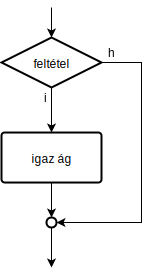

### Összehasonlító operátorok

Feltételekben és ciklusokban kellenek.

| Operátor | Jelentés |
| --- | --- |
| ```==``` | egyenlő |
| ```!=``` | nem egyenlő |
| ```<``` | kisebb |
| ```<=``` | kisebbegyenlő |
| ```>``` | nagyobb |
| ```>=``` | nagyobbegyenlő |

### Logikai operátorok

Összetett feltételeknél hasznosak.

| Operátor | Jelentés |
| --- | --- |
| ```!``` | tagadás |
| ```&&``` | logikai és |
| ```\|\|``` | logikai vagy |

## Elágazások

### If

```C
if( feltétel ){
	igaz ág
	...
}
```



### If + else

```C
if( feltétel ){
	igaz ág
	...
} else {
	hamis ág
	...
}
```


### Switch + case

```C
switch( vizsgált_érték ){
	case érték1:
		igaz ág érték1 esetén
		...
		break;
	case érték2:
		igaz ág érték2 esetén
		...
		break;
	...
	default:
		minden más esetben
		...
		break;
}
```

## Ciklusok

### While

```C
while( feltétel ){
	ciklusmag
	...
}
```


### Do + while (hátultesztelő ciklus)

```C
do{
	ciklusmag
	...
} while( feltétel );
```


### For

```C
for( előkészítés; feltétel; léptetés ){
	ciklusmag
	...
}
```


