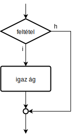
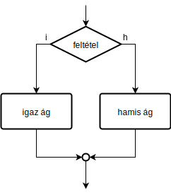
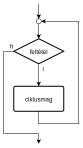
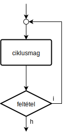
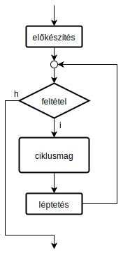

# C jegyzet

A Számítógépek programozásának alapjai c. tárgyhoz készült jegyzet.
Összeállította: Haba Tamás.

## Egy C-ben írt program felépítése

Egyszerűbb esetben csak egyetlen forrásfájlból áll a program, melynek szerkezete az alábbi: 

```C
// Visual Studio használatakor ez a sor is kell:
#define _CRT_SECURE_NO_WARNINGS

// a forráskód elején a program által használt include-ok kellenek, pl:
#include <stdio.h>
#include <conio.h>
// további inculde-ok
// ...

int main(){

	/* itt kezdődik a végrehajtás,
	    ide kerül a program "lényegi" része, pl: */
	printf("Hello World!\n");
	// további utasítások
	// ...
	
	_getch(); // ne lépjen ki egyből a program
	
	return 0; // <- mindig kell, ez jelzi program sikeres futását 
}
```

## Kommentek

A kommentek a program működésében nem vesznek részt, viszont a forráskódot egyértelművé és olvashatóbbá teszik.

```C
// komment állhat külön sorban
printf("Hello World!\n"); // komment állhat utasítás után is
/* de akár több
sorból is állhat */

```

## Változók deklarálása és értékadása

```C
// minden változót használat előtt deklarálni kell
// a típus és a név megadásával
char ch;
int b=55; // változó kaphat kezdeti értéket
float x, pi = 3.141592, y; // ugyanolyan típusból egyszerre több változó is deklarálható

// értékadás
ch = 'R';
x = 1.22;
y = 1e26;

// egy változó értéke akárhányszor felülírható
x = 44.1;

// az értékadás jobb oldalán akár összetett kifejezés is állhat
x = 3*1.1/y + pi;
```

## Adattípusok

Az adattípusok a változók értékkészletét határozzák meg. Különböző platformokon eltérő lehet az értékkészlet, ezért a szabány egy minimális szélességű intervallumot határozott meg.

| Adattípus |  Előírt legszűkebb értékkészlet |
| --- | --- |
| ```signed char``` vagy ```char``` | egész szám -127-től +127-ig |
| ```unsigned char``` | egész szám 0-tól 255-ig |
| ```short int``` vagy ```short``` | egész szám -32767-től +32767-ig |
| ```unsigned short int``` vagy ```unsigned short``` | egész szám 0-tól 65535-ig |
| ```int``` | egész szám -32767-től +32767-ig |
| ```unsigned int``` | egész szám 0-tól 65535-ig |
| ```long int``` vagy ```long``` | egész szám -2147483647-től +2147483647-ig |
| ```unsigned long int``` vagy ```unsigned long``` | egész szám 0-tól 4294967295-ig |
| ```float``` | lebegőpontos szám ~6 tizedesjeggyel |
| ```double ``` | lebegőpontos szám ~10 tizedesjeggyel |

## Számábrázolás

```C
char ch;
int n;
double x;

// az alábbi értékadások egyenértékűek
n = 162; // tízes számrendszer
n = 0xA2; // 16-os számrendszer
n = 0242; // 8-as számrendszer
n = 0b10100010; // 2-es számrendszer

// a karakter is csak egy szám
ch = 'C'; // A C karakter ASCII kódja
ch = 67; // ugyanezt jelenti

x = 0.000023461; // tizedespont
x = 2.3461e-5; // normál alak
```

##  Kiírás és beolvasás

```C
// kiírás printf-fel
printf("sima szöveg");

// speciális karakterek
printf("egyik sor\nmásik sor"); // sortörés
printf("egyik oszlop\tmásik oszlop"); // tabulátor
printf("\n"); // sortörés
printf("\\"); // a \ karakter
printf("\""); // a " karakter

// értékek behelyettesítése a szövegbe
int osszeg = 1325;
printf("végösszeg: %d Ft\n", osszeg); // ezt írja ki: végösszeg: 1325 Ft
printf("%d tyúk %d nap alatt %d tojást tojt\n", 9, 2, 18);
// ezt írja ki: 9 tyúk 2 nap alatt 18 tojást tojt

// beolvasás scanf-fel
int a; float b; double c;
printf("írj be egy egész számot: ");
scanf("%d", &a);
printf("írj be egy tetszőleges számot: ");
scanf("%f", &b);
printf("írj be egy tetszőleges számot: ");
scanf("%lf", &c);
```

### Legyakrabban használt típusok printf/scanf-ben

| Adattípus |  Kiírás | Beolvasás |
| --- | --- | --- |
| ```signed char``` vagy ```char``` | ```%c``` | ```%c``` |
| ```int``` | ```%d``` | ```%d``` |
| ```float``` | ```%f``` vagy ```%g``` | ```%f``` |
| ```double ``` | ```%f``` vagy ```%g``` | ```%lf``` |

## Operátorok

### Aritmetikai műveletek

| Operátor | Jelentés |
| --- | --- |
| ```+``` | összeadás |
| ```-``` | kivonás |
| ```*``` | szorzás |
| ```/``` | osztás |
| ```%``` | osztási maradék |

### Összehasonlító operátorok

Feltételekben és ciklusokban kellenek.

| Operátor | Jelentés |
| --- | --- |
| ```==``` | egyenlő |
| ```!=``` | nem egyenlő |
| ```<``` | kisebb |
| ```<=``` | kisebbegyenlő |
| ```>``` | nagyobb |
| ```>=``` | nagyobbegyenlő |

### Logikai operátorok

Összetett feltételeknél hasznosak.

| Operátor | Jelentés |
| --- | --- |
| ```!``` | tagadás |
| ```&&``` | logikai és |
| ```\|\|``` | logikai vagy |

## Elágazások

### If

```C
if( feltétel ){
	igaz ág
	...
}
```



### If + else

```C
if( feltétel ){
	igaz ág
	...
} else {
	hamis ág
	...
}
```




### Switch + case

```C
switch( vizsgált_érték ){
	case érték1:
		igaz ág érték1 esetén
		...
		break;
	case érték2:
		igaz ág érték2 esetén
		...
		break;
	...
	default:
		minden más esetben
		...
		break;
}
```

## Ciklusok

### While

```C
while( feltétel ){
	ciklusmag
	...
}
```



### Do + while (hátultesztelő ciklus)

```C
do{
	ciklusmag
	...
} while( feltétel );
```



### For

```C
for( előkészítés; feltétel; léptetés ){
	ciklusmag
	...
}
```



## Tömbök

Amennyiben sok ugyanolyan típusú adatot kell tárolni, tömböt használunk. A tömbök az alábbi tualjdonságokkal rendelkeznek:

- ugyanolyan típusú adattagokból állnak
- az adattagok száma a deklaráláskor kerül meghatározásra, ami később nem változhat
- az adattagokat sorszámuk szerint lehet elérni (indexelés)

### Tömb deklarálása

```C
// a tömb típusát és méretét tudni kell a deklaráláskor, ezért ezeket kell megadni
int egesz_szamok[10]; // 10 darab egész számot tartalmazó tömb
int a,b,c, t[10], d, q[5]; // tömbök együtt deklarálhatók sima változókkal és más tömbökkel is, ha a típus megegyezik

// kezdeti értékekkel is deklarálhatunk tömböt
float tomb[4] = {3.14, 1.4142136, 6e23, -4.5678};
int primszamok[] = {2, 3, 5, 7, 11}; // nem kell a méret, mivel az elemek felsorolásából egyértelmű
int tomb2[10] = {1, 2, 3}; // ilyenkor a tömb 10 elemű lesz, és az első három eleme lesz beállítva
```

### Tömb elemeinek elérése

A tömb elemei egyenként indexük megadásával elérhetőek. Az elemek viselkedése teljesen megegyezik a változóékkal: kiolvasható az értékük, kaphatnak új értéket.

```C
// deklarálunk egy új tömböt kezdeti értékekkel
int szamok[] = {8,9,10,11};

// tagonként kezeljük
szamok[0] = 123; // 0-nál kezdődnek az indexek -> a tömb tehát: {123, 9, 10, 11}
szamok[3] += szamok[2]+szamok[1]; // a tömb végül: {123, 9, 10, 30};

// TILOS kicímezni a tömbből!
szamok[4] = 0; // TILOS!
```

#### Példa: tömb másolása

Tömböt csak elemenként lehet elérni, ezért csak elemenként lehet másolni.

```C
// deklarálunk két tömböt
int szamok[] = {8,9,10,11};
int masik[4];

masik = szamok; // HIBÁS!

// helyes megoldás: elemenként másoljuk ciklusban
for(int i=0; i<4; i++){
    masik[i] = szamok[i];
}
```

## Struktúrák

A struktúrák a tömbökkel szemben akkor haszonsak, ha több, de különböző típusú adatot szeretnénk egybefogni.

```C
#include <stdio.>

// a főprogramon kívül definiálom a struktúrát
struct pont3d {
	double x; // az adattagok megadása a változók deklarálásához hasonló
	double y; // DE: kezdeti értékük nem lehet
	double z;
};

// a főprogramban úgy használom, mintha egy adattípus lenne
int main(){
    // deklarálok két 3d-s pontot, A-t és B-t
    struct pont3d A, B;
    
    // adattagok elérése névvel történik
    A.x = 3;
    A.y=-8; 
    A.z=-2.5;
    
    printf("%f\n", A.x);
    
    // struktúrát lehet másolni értékadással
    B = A;
    
    return 0;
}
```

## Beépített matematikai függvények

A forráskód elejére szükséges az alábbi include:
```C
#include <math.h>
```

A leggyakrabban az alábbi matematikai függvényekre van szükség:
```C
// abszolútérték
abs(x); // egész szám abszolútértéke
fabs(x); // valós szám abszolútértéke

// kerekítés
round(x); // kerekítés (3.5 -> 4)
ceil(x); // plafon (3.5 -> 4)
floor(x); // padló (3.5 -> 3)

// hatvány, gyök, logaritmus
pow(alap, kitevo); // hatványozás
sqrt(x); // négyzetgyök
cbrt(x); // négyzetgyök
exp(x); // e az x-ediken
log(x); // természetes logaritmus (ln)
log10(x); // 10-es alapú logaritmus
log2(x); // 2-es alapú logaritmus

// trigonometriai függvények (radián!)
sin(x); // szinusz
cos(x); // koszinusz
tan(x); // tangens
asin(x); // inverz szinusz
acos(x); // inverz koszinusz
atan(x); // inverz tangens
atan2(y,x); // inverz tangens, megfelelő síknegyed figyelembevételével
```

## Véletlenszám-generátor

A forráskód elejére az alábbi include-ok kellenek:
```C
#include <stdlib.h>
#include <time.h>
```

A véletlenszám-generátort egyszer használat előtt inicializálni kell:
```C
srand(time(NULL));
```

Ezután már lehet véletlenszámokat generálni:
```C
int r = rand(); // egész szám 0-tól RAND_MAX-ig
```

#### Példa
```C
#define _CRT_SECURE_NO_WARNINGS
#include <stdio.h>
#include <conio.h>
#include <stdlib.h>
#include <time.h>

int main(){
	// generátor indítása
	srand(time(NULL));
	
	// véletlenszám 0-tól RAND_MAX-ig
	int random = rand();
	printf("0-tol %d-ig: %d\n", RAND_MAX, random);
	
	// véletlenszám 1-től 10-ig
	int egytol_tizig = rand()%10+1;
	printf("1-től 10-ig: %d\n", egytol_tizig);
	
	// valós véletlenszám 0 és 1 között
	double random_valos = (double)rand()/RAND_MAX;
	printf("0-tol 1-ig: %f\n", random_valos);
	
	_getch();
	return 0;
}
```

## Makró-konstansok

A makró-konstansok lényegében helyettesítési szabályok. A C program fordításának legelső lépésében ezek a behelyettesítések mennek végbe. A makró-konstansok segítségével a kódot sokkal érthetőbbé lehet tenni (ld. alábbi példa).

#### Példa

```C
// nincs igaz-hamis típus, de csinálhatunk igaz-hamis konstansokat
#define IGAZ 1
#define HAMIS 0

// matematikai konstansokat is definiálhatunk
#define PI 3.14159265359

// vagy egy jelzőlámpa színeit
#define PIROS 0
#define SARGA 1
#define ZOLD 2
``` 

## Bitműveletek

### Számábrázolás kettes számrendszerben

A számítógép az adatokat binárisan, azaz kettes számrendszerben tárolja (mellesleg ez az egyik Neumann elv). Ilyen formában csak két számjegy létezik, az 1 és a 0. Ezeket biteknek nevezzük.

```C
int szam = 0b1000110; // a forráskódban is adhatunk értéket binárisan
printf("%d\n", szam);
```

### Bitenkénti műveletek

A formális logikából jól ismert műveleteket (negálás, és, vagy, kizáróvagy) el lehet végezni bitről bitre az alábbi operátorok segítségével:

| Operátor | Jelentés |
| --- | --- |
| ```~``` | bitenkénti negálás |
| ```&``` | bitenkénti és |
| ```\|``` | bitenkénti vagy |
| ```^``` | bitenkénti kizáró vagy |
| ```>>``` | jobbraléptetés |
| ```<<``` | balraléptetés |

#### Példa

```C
// az unsigned char pont 8 bites, ezekkel fogunk dolgozni
unsigned char a=0b00100011;
unsigned char b=0b11000101;
unsigned char c;


/* bitenkénti negálás: nullák és egyesek felcserélése
   a:  0b00100011
   ~a: 0b11011100 */
c = ~a; // nem keverendő a ! operátorral!


/* bitenkénti vagy: az eredmény csak akkor 1, ha bármelyik bit 1
   a:   0b00100011
   b:   0b11000101
   a|b: 0b11100111 */
c = a|b; // nem keverendő az || operátorral!


/* bitenkénti és: az eredmény csak akkor 1, ha mindkét bit 1
   a:   0b00100011
   b:   0b11000101
   a&b: 0b00000001 */
c = a&b; // nem keverendő az && operátorral!


/* bitenkénti kizáró vagy: az eredmény csak akkor 1, ha csak az egyik bit 1
   a:   0b00100011
   b:   0b11000101
   a^b: 0b11100110 */
c = a^b;

/* jobbraléptetés: bitek elcsúsztatása adott számú lépéssel jobbra,
   a kicsúszott bitek elvesznek, a becsúszottak mindig nullák
   
   pl: két lépés jobbra
   a:    0b00100011
   a>>2: 0b00001000 */
c = a>>2;

/* balraléptetés: bitek elcsúsztatása adott számú lépéssel balra,
   a kicsúszott bitek elvesznek, a becsúszottak mindig nullák
   
   pl: két lépés balra
   a:    0b00100011
   c<<2: 0b10001100 */
c = a<<2;
```

## Függvények

Egy összetett problémát célszerű részfeladatokra bontással megoldani. Egy részfeladat megoldását pedig érdemes függvénnyel megvalósítani. A függvény kaphat paramétereket (argumentumokat) és visszatérhet egy értékkel (visszatérési érték).

### Függvény definiálása

Az alábbi példák alapján kell egy függvényt definiálni:

```C
// összead két számot, majd visszatér az összeggel
int osszead(int a, int b){
    return a+b;
}

// nem muszáj, hogy legyen paramétere a függvénynek:
double pi_kiszamol(){
    return 3.14159265358979323846;
}

// nem muszáj, hogy legyen visszatérési értéke,
// ekkor a függvény void típusú
void osszeg_kiir(int a, int b){
    printf("a+b=%d\n", a+b);
}
```

### Függvény hívása

A függvények meghívása ugyanúgy történik, mint az eddig használt beépített függvényeknél:

```C
int main(){
    int x=9;
    int osszeg = osszead(3,x); // <- visszatérési értékre értékelődik ki
    osszeg_kiir(5,6);
    ...
}
``` 

### Érték szerinti paramétreátadás

Egy függvény hívásakor a paraméterek értékei lemásolódnak, így nem tud a hívó változóihoz hozzáférni.

```C
void fuggveny(int argumentum){
    argumentum++; // csak a saját másolatát változtatja meg
}

int main(){
    int a=1;
    fuggveny(a);
    printf("%d\n", a); // 1-et ír ki
    
    return 0;
}
```

### Főhatás és mellékhatás fogalma

Egy függvény **főhatása** a visszatérési értéke. A **mellékhatás** minden más változtatás, amit a függvény végrehajt (pl.: kiírás stb).

Azért fontos ezzel tisztában lenni, mert a feladatok megfogalmazásában van elrejtve, hogy a függvény mit csináljon: Írj egy függvényt, ami kiszámolja két szám összegét! vagy Írj egy függvényt, ami kiírja két szám összegét! Előbbi esetben a főhatás volt a lényeg (tehát az összeg visszatérési érték legyen), utóbbiban a mellékhatás (jelen esetben kiírás).

### Lokális, globális, statikus változók

**Lokális változó**: Minden függvényhívásnál újra létrejön, csak az adott függvény férhet hozzá. Függvény visszatérésekor megszűnik. Ilyenek a függvényen belül deklarált változók és az argumentumok is.

**Globális változó:**: A program indulásakor jön létre, bármelyik függvény hozzáférhet. A program futása után szűnik meg. Ilyenek a függvényeken kívül deklarált változók.

**Statikus változó**: A lokális és a globális változó "keveréke": A program indulásakor jön létre, de csak az adott függvény férhet hozzá. A program futása után szűnik meg. Ilyenek a static kulcsszóval, függvényen belül deklarált  változók.

A viselkedésbeli különbségek jól nyomonkövethetők az alábbi példán keresztül:

```C
#define _CRT_SECURE_NO_WARNINGS
#include <stdio.h>
#include <conio.h>

// globális változó
int globalis = 0;

void fuggveny1(){
    static int statikus = 0; // statikus változó
    int lokalis = 0; // lokális változó
    
    globalis++;
    statikus++;
    lokalis++;
    
    printf("fuggveny1 globalis valtozoja: %d\n", globalis);
    printf("fuggveny1 statikus valtozoja: %d\n", statikus);
    printf("fuggveny1 lokalis valtozoja: %d\n", lokalis);
}

void fuggveny2(){
    static int statikus = 0; // statikus változó
    int lokalis = 0; // lokális változó
    
    globalis++;
    statikus++;
    lokalis++;
    
    printf("fuggveny2 globalis valtozoja: %d\n", globalis);
    printf("fuggveny2 statikus valtozoja: %d\n", statikus);
    printf("fuggveny2 lokalis valtozoja: %d\n", lokalis);
}

int main(){

	// meghívjuk
	fuggveny1();
	fuggveny2();
	fuggveny1();
	fuggveny2();
	
	_getch(); // ne lépjen ki egyből a program
	
	return 0; // <- mindig kell, ez jelzi program sikeres futását 
}
```
Ennek kimenete:

```
fuggveny1 globalis valtozoja: 1
fuggveny1 statikus valtozoja: 1
fuggveny1 lokalis valtozoja: 1

fuggveny2 globalis valtozoja: 2
fuggveny2 statikus valtozoja: 1
fuggveny2 lokalis valtozoja: 1

fuggveny1 globalis valtozoja: 3
fuggveny1 statikus valtozoja: 2
fuggveny1 lokalis valtozoja: 1

fuggveny2 globalis valtozoja: 4
fuggveny2 statikus valtozoja: 2
fuggveny2 lokalis valtozoja: 1
```

### Rekurzió

Függvény meghívhat más függvényeket, de önmagát is. Utóbbi esetben beszélünk rekurzióról. Ilyenkor mindenképp szükség van valamilyen megállási feltételre, hogy ne hívogassa magát a függvény végtelenségig.

Például:

```C
// n-edik fibonacci számot kiszámoló függvény
int fib(int n){
    // kilépési feltétel: ebben az esetben tudjuk rögtön a választ
    if(n==1 || n==2)
        return 1;
    
    // minden más esetbena a sorozat definíciója szerint járunk el (rekurzívan)
    return fib(n-2) + fib(n-1);
}
```

## Pointerek

A pointerek (mutatók) olyan változók, amik memóriacímet tárolnak. Úgy kell tekinteni őket, mintha másik változóra mutatnának.

Példa:

```C
int a=3; // ez egy egyszerű egész típusú változó

int *p; // ez egy egész típusú változóra mutató pointer
// itt még nem mutat semmire

p = &a; // & operátor: címképző operátor, a változó memóriacímét adja vissza
// itt már a-ra mutat

*p = 8; // * operátor: a pointer által mutatott érték
// itt már a változó értéke megváltozott
```

### Pointerek deklarálása

Deklarációkor arra kell ügyelni, hogy a * karakter a változóhoz tartozik, nem a típushoz.

```C
// az alábbi megadás szabályos:
int* a, b, c;
// de félrevezető, hiszen csak a lett pointer, b és c sima int típusú változó lett

// kevésbé félrevezető megadás:
int *a, b, c;
// szerencsésebb, mert látszik, hogy a * a változóhoz tartozik.

// szabályos az alábbi megadás is:
int b, *c, d, *e, *f, *g, h;

// tanulság: az a változó pointer, amelyik előtt van csillag!
```

### Tömbök, mint pointerek

A tömbök elemei egymás után helyezkednek el a memóriában, éppen ezért elegendő a legelső elem címét ismerni. C nyelven a tömb is olyan, mint egy pointer.

```C
int tomb[10]; // egy egyszerű tömb

int *kezdoelem = &(tomb[0]); // kezdőelemre mutató pointer

int *ptr = tomb; // ez ugyanazt jelenti!
```

Tömböket átadhatunk függvényeknek úgy, mintha pointerek lennének:

```C
// n elemű tömb elemeinek kiírása
void tomb_kiir(int *tomb, int n){
    for(int i=0; i<n; i++){
        printf("%d\n", tomb[i]); // ugyanúgy indexelhetjük, mint egy tömböt
    }
}

int main(){
    int t[10];
    tomb_kiir(t, 10); // csak a tömb nevét kell átatdni paraméterként
}
```

### Pointer aritmetika

Egy pointerhez hozzáadhatunk egész számot (vagy kivonhatunk belőle). Maga a memóriacím viszont nem egyesével változik, hanem a mutatott típus méretének megfelelően.

Például:
```C
int szamok[10];
int *p;

p=szamok; // így a kezdőelemre mutat
p++; // a pointert megnöveltük eggyel
// de a memóriacím nem eggyel növekszik meg, hanem pont annyival, hogy a tömb következő elemére mutasson!
```

Pointerek különbsége is hasonlóan működik: nem a memóriacímeket vonja ki egymásból, hanem a mutatott típus méretét is figyelmbe veszi.

```C
int szamok[10];

int *egyik = szamok; // kezdőelemre mutat
int *masik = &(szamok[4]); // szamok[4]-re mutat

egyik++; // szamok[1]-re mutat

int i = masik-egyik; // értéke: 3
```

## Fájlkezelés

Fájlkezeleés során minden esetben az alábbi sémát kell követni: 

- fájl megnyitása (fopen)
- munkavégzés a fájlon (fprintf, fscanf)
- fájl bezárása (fclose)

### Fájl megnyitása és bezárása

A fájl megnyitása az fopen függvénnyel történik. Első paramétere a fájlnév (vagy a teljes elérési útvonal), a második a megnyitás módja.

Fájl megnyitási módjai:

- "r" (olvasás): Csak létező fájlt lehet így megnyitni, amiből ezután ki lehet olvasni a tartalmát.
- "w" (írás): Ha a fájl nem létezik, létrehozza. Ha létezik, akkor tartalma törlődik. Ebben a módban írni lehet a fájlba.
- "a" (hozzáfűzés):  Ugyanaz, mint az előző, de a fájl korábbi tartalma megmarad, az újonnan beírt adatok folytatólagosan kerülnek a fájlba.

Az fopen egy FILE* típusú pointerrel tér vissza. Ezt a pointert kell megadni minden további fájlkezelő függvénynek, hogy tudják, melyik fájlon kell dolgozni.

Fájl bezárása az fclose függvénnyel történik. Sosem szabad elfelejteni!

```C
// megnyitás
FILE *fp = fopen("szoveg.txt", "r");

// munkavégzés a fájlon
// ...

// lezárás
fclose(fp);
```

### Adatok kiírása fájlba

Amikor "w" vagy "a" módban lett megnyitva egy fájl, az fprintf segítségével lehet bele adatokat kiírni pont úgy, ahogy azt a printf-nél megszokhattuk. Az egyetlen különbség az, hogy első argumentumként a megfelelő fájl pointert kell átadni.

```C
fprintf(fp, "Hello! %d\n", 12);
```

### Adatok beolvasása fájlból

Amikor "r" módban lett megnyitva egy fájl, az fscanf függvénnyel olvasható be belőle adat. Ennek működése megegyezik a sima scanf működésével, csak első argumentumként itt is át kell adni a fájl pointert.

```C
int szam;
fscanf(fp, "%d", &szam);
```

### Fájl végének meghatározása

Gyakran ismeretlen számú adat van az olvasott fájlban, ezért tudnunk kell, ha elértük a fájl végét. Érdemes erre az fscanf visszatérési értékét használni: ha sikeres volt a beolvasás, akkor a visszatérési érték a beolvasott paraméterek számával egyezik meg.

```C
// minden sorban van egy szám, amit beolvasunk
while(1){
	// megpróbáljuk beolvasni (lehet, hogy nem sikerül)
	double szam;
	int beolvasva = fscanf(fp, "%lf", &szam);
	
	// ha nem sikerült a beolvasás, kilépünk
	if(beolvasva!=1)
		break;
	
	// adatfeldolgozás
	// ...
}
```
